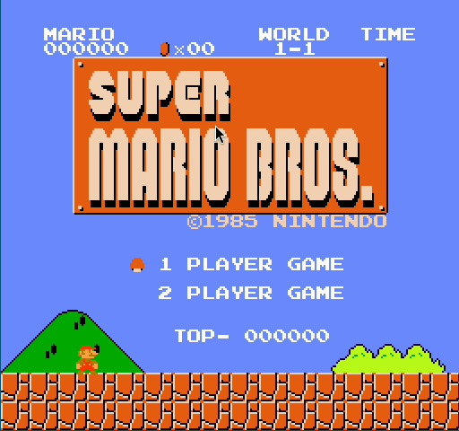
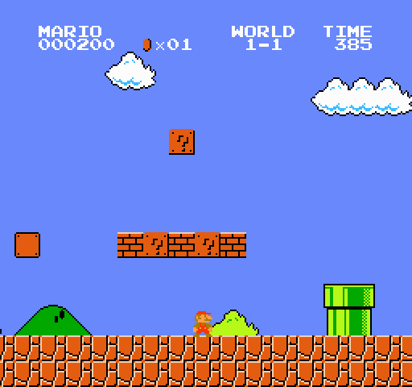
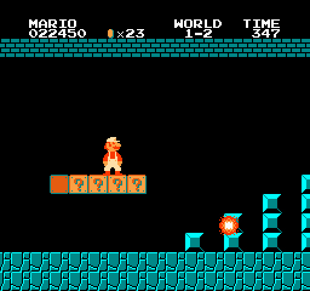
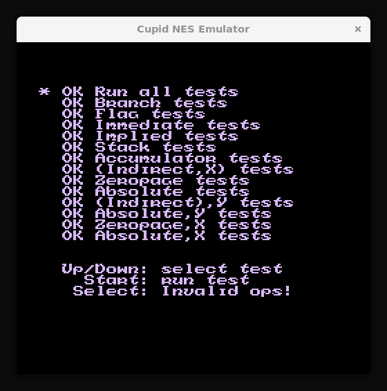
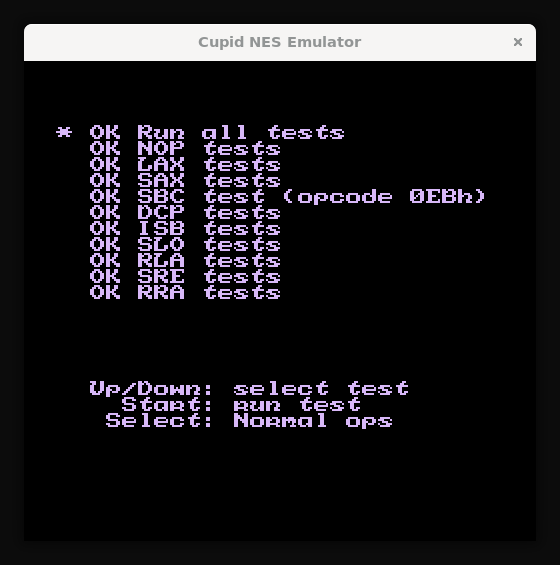
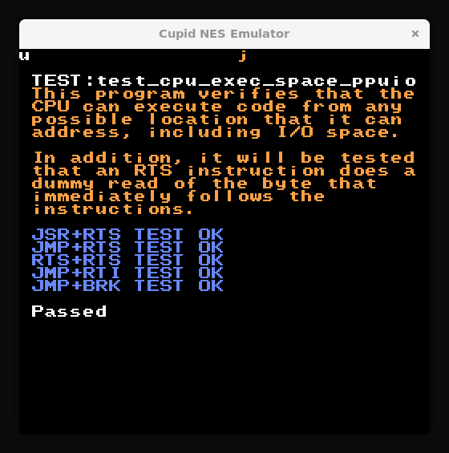
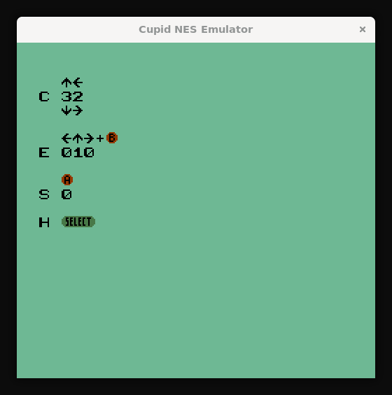
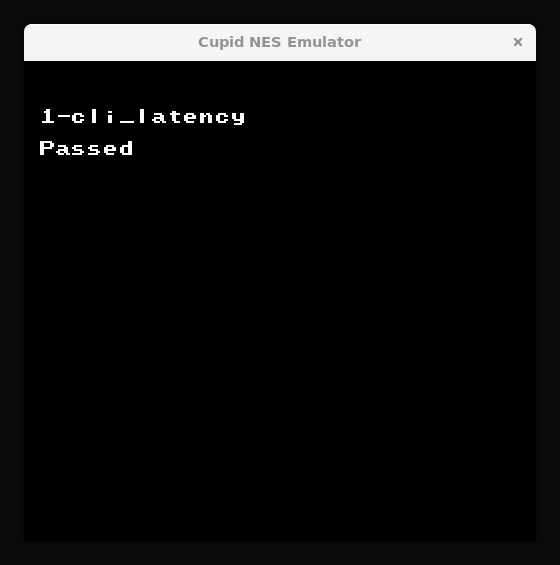
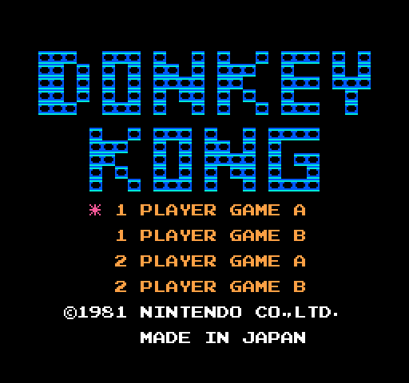
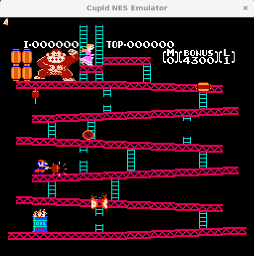

# Cupid NES Emulator

Cupid NES Emulator is a feature-rich NES emulator implemented in C. It accurately emulates the 6502 CPU architecture, PPU graphics system, APU audio subsystem, and supports multiple mapper configurations. The project demonstrates advanced NES hardware emulation with the ability to run commercial NES games.

## Table of Contents

- [🎮 MAJOR MILESTONE: Super Mario Bros Fully Playable!](#-major-milestone-super-mario-bros-fully-playable)
- [Features](#features)
  - [6502 CPU Emulation](#6502-cpu-emulation)
  - [Multiple Addressing Modes](#multiple-addressing-modes)
  - [Memory Map Simulation](#memory-map-simulation)
  - [Advanced Mapper Support](#advanced-mapper-support)
  - [ROM Loading](#rom-loading)
  - [PPU Emulation](#ppu-emulation)
  - [APU (Audio Processing Unit) Emulation](#apu-audio-processing-unit-emulation)
  - [Joypad Input](#joypad-input)
  - [Graphical Output](#graphical-output)
- [Test Results](#test-results)
  - [CPU Tests](#cpu-tests)
  - [PPU and Graphics Tests](#ppu-and-graphics-tests)
  - [Commercial Game Tests](#commercial-game-tests)
  - [Test ROMs Included](#test-roms-included)
- [Project Structure](#project-structure)
- [Requirements](#requirements)
- [Installation & Usage](#installation--usage)
  - [Building the Emulator](#building-the-emulator)
  - [Running with a ROM](#running-with-a-rom)
  - [Keyboard Controls](#keyboard-controls)
  - [Runtime Palette Editor](#runtime-palette-editor)
- [Emulation Details](#emulation-details)
  - [CPU Cycle Timing](#cpu-cycle-timing)
  - [Addressing Mode Implementation](#addressing-mode-implementation)
  - [PPU Memory Management](#ppu-memory-management)
  - [APU Audio Generation](#apu-audio-generation)
  - [Mapper Architecture](#mapper-architecture)
- [Limitations and Future Improvements](#limitations-and-future-improvements)
- [Contributing](#contributing)
- [License](#license)
- [Resources](#resources)

## 🎮 MAJOR MILESTONE: Super Mario Bros Fully Playable!

**BREAKTHROUGH ACHIEVEMENT:** The emulator can now successfully run and play Super Mario Bros, one of the most iconic and demanding NES games! This represents a monumental achievement in NES emulation, validating that all core systems-CPU, PPU, APU, memory mapping, and timing-are working together with commercial-game accuracy.

<p align="center">
  
</p>

<p align="center">
  
</p>

<p align="center">
  
</p>

<p align="center">
  
</p>

This milestone validates:
- ✅ Complete 6502 CPU instruction set with cycle-accurate timing
- ✅ Advanced PPU background and sprite rendering with scrolling
- ✅ Sprite 0 hit detection for split-screen effects
- ✅ Full APU audio implementation with all 5 channels
- ✅ Accurate mapper support (NROM, MMC1, MMC3, and more)
- ✅ Precise memory mapping and ROM loading
- ✅ Working joypad input system
- ✅ Correct frame timing and NMI/IRQ interrupt handling
- ✅ Full compatibility with commercial NES games

## Features

### 6502 CPU Emulation

Implements a comprehensive 6502 instruction set including:

- **Data Transfer:** LDA, STA, TAX, TXA, LDY, LDX, STX, STY, LAX (undocumented)
- **Arithmetic:** ADC, SBC, INC, DEC, INX, INY, DEX, DEY
- **Logical:** AND, ORA, EOR, BIT
- **Comparison:** CMP, CPX, CPY
- **Branching:** BEQ, BNE, BCC, BCS, BMI, BPL, BVS, BVC
- **Jump/Call:** JMP (Absolute, Indirect), JSR/RTS, RTI
- **Stack Operations:** PHP/PLP, PHA/PLA, TSX/TXS
- **Shift/Rotate:** ASL, LSR, ROL, ROR
- **Undocumented Instructions:** DCP, RLA, SLO, SRE, RRA, SAX, ISC, SHX, SHY, SHA, TAS, LAS, and various undocumented NOPs
- **Interrupt Handling:** BRK, NMI, IRQ with proper timing delays

### Multiple Addressing Modes

Supports all major 6502 addressing modes:

- Immediate
- Zero Page, Zero Page,X, Zero Page,Y
- Absolute, Absolute,X, Absolute,Y
- Indexed Indirect ((Indirect,X)) and Indirect Indexed ((Indirect),Y)
- Absolute Indirect (for JMP)
- Relative addressing for branch instructions
- Proper 6502 page-boundary crossing behavior and dummy reads

### Memory Map Simulation

- 2KB internal RAM with mirroring (0x0000–0x1FFF)
- PPU registers (0x2000–0x3FFF, mirrored every 8 bytes)
- APU/I-O registers (0x4000–0x401F)
- Joypad input (0x4016, 0x4017)
- PRG-RAM (0x6000–0x7FFF, 8KB)
- Program ROM (PRG-ROM) with mapper-controlled banking

### Advanced Mapper Support

The emulator now supports multiple mapper configurations for broad ROM compatibility:

- **Mapper 0 (NROM):** Basic mapper for simple games
- **Mapper 1 (MMC1/SxROM):** Advanced mapper with bank switching and mirroring control
- **Mapper 2 (UxROM):** 16KB PRG bank switching
- **Mapper 3 (CNROM):** CHR bank switching
- **Mapper 4 (MMC3):** Advanced mapper with IRQ support and fine-grained banking
- **Mapper 5 (MMC5):** Extended capabilities for advanced games
- **Mapper 7 (AxROM):** 32KB PRG switching with single-screen mirroring
- **Mapper 9/10 (MMC2/MMC4):** Latch-based CHR switching
- **Mapper 11 (Color Dreams):** Simple banking
- **Mapper 13 (CPROM):** CHR-RAM banking
- **Additional mappers up to Mapper 15**

This mapper support enables compatibility with a wide range of commercial NES games, including Super Mario Bros (NROM), and many others.

### ROM Loading

Supports loading NES ROMs in the standard iNES file format. The loader extracts:

- PRG-ROM data (8KB, 16KB, or 32KB per bank)
- CHR-ROM data (1KB, 2KB, 4KB, or 8KB per bank) or CHR-RAM if no CHR-ROM is present
- Mirroring mode (Horizontal/Vertical/Single-screen/Four-screen) based on header flags
- Automatic mapper detection and initialization from iNES header
- PRG-RAM support for games requiring save data

### PPU Emulation

Full Picture Processing Unit implementation with advanced features:

- **VRAM and OAM:** Complete PPU memory spaces with proper mirroring
- **PPU Registers:** Full implementation of $2000–$2007 with proper scroll and address handling
- **Loopy Registers:** Accurate VRAM address register (v, t, x, w) implementation for scrolling
- **OAM DMA:** Full 256-byte DMA transfer via $4014
- **Background Rendering:** Renders full 256×240 background using nametables, attribute tables, and pattern tables
- **Sprite Rendering:** Renders up to 64 sprites from OAM with proper palette lookup and priority
- **Sprite 0 Hit Detection:** Accurate sprite 0 hit timing for split-screen effects (critical for SMB status bar)
- **VBlank Interrupt:** NMI generation at VBlank based on PPUCTRL bit 7
- **Palette Support:** Full 64-color NES palette with palette mirroring
- **Nametable Mirroring:** Configurable horizontal/vertical/single-screen/four-screen mirroring modes
- **Scrolling:** Proper PPUSCROLL handling with fine X/Y and coarse coordinate management
- **Cycle Timing:** Accurate NTSC timing with VBlank scheduling and sprite 0 hit prediction
- **Open Bus Behavior:** Proper PPU open bus simulation for accuracy

### APU (Audio Processing Unit) Emulation

Complete audio subsystem implementation with all five NES sound channels:

- **Pulse Channels (2):** Square wave generation with duty cycle control (12.5%, 25%, 50%, 25% negated)
  - Hardware envelope generation
  - Frequency sweep units with pitch bending
  - Length counter for note duration
- **Triangle Channel:** Triangle wave generation for bass and melody
  - Linear counter for precise control
  - Length counter support
- **Noise Channel:** Pseudo-random noise generation for percussion and effects
  - 15-bit and 7-bit LFSR modes
  - Configurable period from noise period table
- **DMC Channel:** Delta Modulation Channel (basic support)
- **Frame Sequencer:** 4-step and 5-step modes for envelope/length/sweep clocking
- **Audio Output:** Real-time audio mixing and output via SDL2
- **Sample Rate Conversion:** Proper downsampling from 1.79MHz CPU clock to audio sample rate (44.1kHz)
- **Frame IRQ:** Interrupt generation support for frame counter

### Joypad Input

- Full controller support (A, B, Select, Start, Up, Down, Left, Right)
- Proper strobe and shift register behavior matching NES hardware
- SDL keyboard mapping for intuitive control

### Graphical Output

- Real-time rendering via SDL2
- Display of background and sprite layers with proper priority
- 2x pixel scaling for better visibility
- 60 FPS frame rate matching NTSC NES

## Test Results

The emulator has been extensively tested with various NES test ROMs and commercial games to verify correct implementation of CPU instructions, PPU functionality, APU operation, mapper support, and overall emulation accuracy.

### CPU Tests

**Nestest Results**

<p align="center">
  
</p>

<p align="center">
  
</p>

The nestest ROM validates CPU instruction execution, addressing modes, and flag behavior. Both test screens show successful completion with all tests passing.

**CPU Execution Space Tests**

<p align="center">
  
</p>

This test verifies proper CPU execution in PPU I/O space, ensuring correct memory mapping and register behavior.

### PPU and Graphics Tests

**Color Test**

<p align="center">
  
</p>

The color test validates the PPU's palette rendering capabilities, showing proper color output and palette management.

**CLI Latency Test**

<p align="center">
  
</p>

This test verifies interrupt handling and timing accuracy, particularly for CLI (Clear Interrupt Disable) instruction behavior.

### Commercial Game Tests

**Donkey Kong**

<p align="center">
  
</p>

<p align="center">
  
</p>

Donkey Kong runs perfectly, demonstrating accurate CPU, PPU, and memory system implementation. The game is fully playable with proper graphics, controls, and game logic.

### Test ROMs Included

The project includes several test ROMs for validation:
- `nestest.nes` - Comprehensive CPU instruction testing
- `1-cli_latency.nes` - Interrupt timing validation
- `2-nmi_and_brk.nes` - NMI and BRK instruction testing
- `color_test.nes` - PPU color and palette testing
- `test_cpu_exec_space_ppuio.nes` - CPU execution in PPU I/O space
- `test_cpu_exec_space_apu.nes` - CPU execution in APU space
- `cpu_interrupts.nes` - Interrupt handling verification
- `cpu_timing_test.nes` - CPU cycle timing tests
- `ram_retain.nes` - RAM retention testing

All tests demonstrate successful emulation of the NES hardware components.

## Project Structure

```
cupid-nes/
├── Makefile                 # Build configuration using gcc and SDL2
├── README.md                # Project documentation
├── include/
│   └── globals.h            # Global constants and shared definitions
└── src/
    ├── main.c               # Main emulation loop and SDL setup
    ├── cpu/
    │   ├── cpu.c            # 6502 CPU implementation with full instruction set
    │   └── cpu.h            # CPU interface and status flag definitions
    ├── ppu/
    │   ├── ppu.c            # PPU functionality, rendering, mirroring, and VBlank
    │   └── ppu.h            # PPU interface with Loopy register support
    ├── apu/
    │   ├── apu.c            # APU implementation with all 5 channels
    │   └── apu.h            # APU interface and channel structures
    ├── rom/
    │   ├── rom.c            # ROM loading and iNES header parsing
    │   ├── rom.h            # ROM interface and iNES header structure
    │   ├── mapper.c         # Mapper implementations (0-15)
    │   └── mapper.h         # Mapper interface and abstraction
    └── joypad/
        ├── joypad.c         # Joypad controller state management
        └── joypad.h         # Joypad interface
```

## Requirements

- **Compiler:** GCC (or any C compiler that supports C99)
- **Operating System:** Linux or any POSIX-compliant system
- **Build Tools:** Make
- **Libraries:** SDL2 (for graphical and audio output)

## Installation & Usage

### Building the Emulator

From the root directory of the project, run:

```bash
make
```

This will compile all source files and create an executable named `cupid-nes`.

### Running with a ROM

To load and run an NES ROM:

```bash
./cupid-nes path/to/rom.nes
```

For example, to play Super Mario Bros:

```bash
./cupid-nes "Super Mario Bros. (Japan, USA).nes"
```

The emulator will:
- Load the ROM and print header information
- Detect and initialize the appropriate mapper
- Initialize the CPU, PPU, and APU
- Open an SDL window and begin execution
- Display background and sprite graphics in real time
- Output audio through your system's audio device

### Keyboard Controls

- **Z** – A button
- **X** – B button
- **Right Shift** – Select button
- **Enter** – Start button
- **Arrow Keys** – D-Pad (Up, Down, Left, Right)

### Runtime Palette Editor

The emulator includes a built-in **palette editor tool** that lets you customize NES colors on the fly without recompiling. Perfect for experimenting with different color palettes or creating custom visual styles.

#### Features

- **Interactive color picker**: Click any of the 64 NES palette colors to open an HSV color picker with live preview
- **Visual palette overlay**: Press **F7** to toggle a color swatch grid showing all 64 active colors
- **Smart color suggestions**: The picker shows 4 brightness variants from the original NES palette for quick access to authentic-looking colors
- **Multiple input methods**:
  - Click and drag in the HSV picker for precise control
  - Drag-and-drop `.pal` files (192 or 1536 bytes) onto the window
  - Paste palette data from clipboard (**Ctrl+V**) in multiple formats
- **Instant preview**: Changes are applied immediately to the running game
- **Non-destructive**: Reset to default with **F6** at any time

#### Controls

- **F7** – Toggle palette overlay (shows current 64 NES colors)
- **F6** – Reset to built-in default palette
- **Left-click** – Select a color swatch to edit
- **Drag** – Adjust hue/saturation/value in the color picker
- **Click suggestions** – Apply recommended NES-like colors
- **Ctrl+V** – Paste palette from clipboard

#### Supported Formats

**Drag-and-drop `.pal` files:**
- 192 bytes: 64 colors × 3 bytes (R, G, B)
- 1536 bytes: 8 emphasis variants × 64 colors × 3 bytes

**Clipboard paste (Ctrl+V):**
- 64 space/comma-separated `RRGGBB` tokens (e.g., `FF0000 00FF00 0000FF ...`)
- Also accepts `#RRGGBB`, `$RRGGBB`, or `0xRRGGBB` prefixes
- Raw hex string of 192 or 1536 bytes (whitespace ignored)

#### Emphasis Handling

- **1536-byte palettes**: Use pre-computed emphasis tables for authentic hardware behavior
- **192-byte palettes**: Apply software emphasis simulation (60% attenuation)
- **Grayscale mode**: PPUMASK bit 0 respected in all modes

#### Developer API

Palette functions are exposed in `src/ppu/ppu.h`:

```c
int  ppu_palette_load_pal_file(const char *path);      // Load .pal file
int  ppu_palette_load_hex_string(const char *text);    // Parse hex string
void ppu_palette_reset_default(void);                  // Reset to default
void ppu_palette_get(uint32_t out[64]);                // Get active palette (ARGB)
int  ppu_palette_set_color(int index, uint8_t r, uint8_t g, uint8_t b);  // Set individual color
bool ppu_palette_has_emphasis_tables(void);            // Check emphasis mode
```

The palette tool UI is implemented in `src/ui/palette_tool.{c,h}` as a self-contained module.

## Emulation Details

### CPU Cycle Timing

The emulator implements accurate NTSC NES timing:

- CPU frequency: 1,789,773 Hz
- Frame rate: 60 Hz
- CPU cycles per frame: ~29,796
- Visible scanlines: 242 (0-241)
- VBlank scanlines: 20 (241-260)
- Proper cycle counting for all instructions
- IRQ and NMI delay emulation

### Addressing Mode Implementation

The CPU includes proper 6502 quirks:

- Page-boundary crossing with dummy reads on indexed addressing modes
- 6502 indirect addressing bug in JMP (Absolute Indirect)
- Stack pointer wrapping at 0x00/0xFF
- Proper flag updates and preserved carry behavior in shift/rotate operations
- Undocumented instruction support for maximum compatibility

### PPU Memory Management

- Nametable mirroring respects ROM configuration and mapper control
- Palette RAM with special $3F10/$3F14/$3F18/$3F1C mirroring to $3F00
- Proper VRAM address latching for $2005 (scroll) and $2006 (address) writes
- Read buffer behavior for $2007 (palette reads bypass buffer)
- Sprite 0 hit detection with scanline and pixel-accurate prediction
- Open bus behavior for unused register bits

### APU Audio Generation

- Separate timer and sequencer logic for each channel
- Proper envelope, sweep, and length counter implementation
- Accurate noise LFSR for percussion sounds
- Frame counter with 4-step and 5-step modes
- Audio mixing with proper volume levels
- Real-time sample generation and buffering

### Mapper Architecture

- Abstracted mapper interface supporting CPU and PPU address spaces
- Configurable PRG and CHR banking
- Dynamic mirroring control for games that change nametable layout
- Extensible design for adding new mappers

## Limitations and Future Improvements

- **Extended Mapper Support:** While 0-15 are implemented, additional mappers (MMC6, VRC series, etc.) would expand compatibility further
- **Cycle-Perfect Timing:** Current timing is very accurate but could be refined to true cycle-perfect emulation
- **Full DMC Implementation:** Basic DMC support is present; full sample playback could be enhanced
- **Save State Support:** Ability to save and load game progress
- **Debugging Tools:** Integrated debugger with breakpoints, memory inspection, and disassembly
- **Performance Optimizations:** Further optimization for high-speed rendering and audio processing
- **PAL Support:** Currently NTSC only; PAL timing would expand regional compatibility

## Contributing

Contributions are welcome! To contribute:

1. Fork the repository
2. Create a feature branch for your changes
3. Test your implementation thoroughly with test ROMs and games
4. Submit a pull request with a detailed description
5. Update documentation as needed

## License

This project is open source under the GNU v3 License. See the [LICENSE](LICENSE) file for more details.

## Resources

- [NESdev Wiki](https://www.nesdev.org/wiki/Nintendo_Entertainment_System)
- [6502 CPU Documentation](http://www.6502.org/tutorials/6502opcodes.html)
- [SDL2 Documentation](https://wiki.libsdl.org/)
- [NES PPU Documentation](https://www.nesdev.org/wiki/PPU)
- [NES APU Documentation](https://www.nesdev.org/wiki/APU)
- [Undocumented 6502 Instructions](https://www.nesdev.org/undocumented_opcodes)
- [Mapper Documentation](https://www.nesdev.org/wiki/Mapper)
