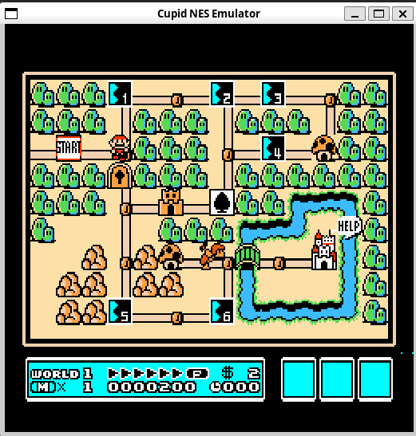
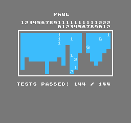

# Cupid NES Emulator

Cupid is an NES emulator written in C, with NTSC, PAL, and Dendy timing and SDL2 for video, input, and audio.

The current core passes **144/144 AccuracyCoin tests**, with zero skipped or unfinished results, plus the 91-ROM diagnostic collection and the 8,991-state canonical CPU trace. Reproduction commands and test limits are below.

<p align="center">
  
</p>
<p align="center">
  
</p>

## Build and run

### Linux

The build requires a C11 compiler, Make, and SDL2 development libraries. On Ubuntu:

```sh
sudo apt install build-essential libsdl2-dev
make
./cupid-nes path/to/game.nes
```

Clang is also supported: `make CC=clang`.

### Windows

Install Clang and the Windows SDK/MSVC build tools, then extract the SDL2 VC development package. From PowerShell in the repository root:

```powershell
.\scripts\test-windows.ps1 -SdlRoot C:\path\to\SDL2-2.32.10
.\build\windows\cupid-nes.exe C:\path\to\game.nes
```

The script builds the application and hardware tests, copies the SDL2 runtime beside the executables, and runs the regression suite. It accepts `-Compiler` to select another Clang executable and `-Sanitize` to build with AddressSanitizer and UndefinedBehaviorSanitizer. Sanitized binaries go in `build/windows-sanitized`.

## Hardware implementation

The CPU clocks the PPU, APU, and cartridge during each bus access. `cpu_step` returns elapsed CPU cycles after those devices have advanced; callers must not advance the PPU a second time.

The CPU core includes official and undocumented opcodes, page-crossing and read-modify-write bus accesses, interrupt polling, BRK vector hijacking, and JAM behavior. OAM and DMC transfers share the CPU bus, including halt, alignment, and overlap behavior. Controller reads preserve floating data lines and use the strobe and serial shift registers.

The ROM header selects the timing region. NTSC frames have 262 scanlines; PAL and Dendy frames have 312. PAL uses a 3.2:1 PPU/CPU clock ratio, while NTSC and Dendy use 3:1. Dendy starts vblank later in its frame. Dual-region NES 2.0 images default to NTSC.

The PPU renders 256 by 240 pixels. Background and sprite pattern reads occur in their scheduled fetch slots. Sprite evaluation, overflow, clipping, priority, and sprite-zero hits use that pipeline. Sprite pattern shifters hold their remaining bits when rendering stops. Register handling includes palette mirrors, delayed address writes and buffered memory transfers, consecutive-read suppression, open bus, rendering-time address increments, and vblank/NMI edges. Only rendered NTSC odd frames skip a pre-render clock. PAL includes its vblank OAM refresh and PAL/Dendy color-emphasis wiring.

The APU implements two pulse channels, triangle, noise, and DMC. It includes envelopes, length and linear counters, sweep units, the four- and five-step frame sequences, frame and DMC interrupts, and nonlinear channel mixing. DMC reads are fulfilled through the CPU DMA engine. The triangle DAC retains its value when its sequencer stops.

PAL uses its own noise/DMC periods, frame-sequencer timing, and DMA start rules. Dendy uses the NTSC APU periods at its CPU clock rate. Power-on and soft reset have separate APIs. CPU reset performs its seven bus reads and stack-pointer decrements; soft reset preserves CPU registers and RAM, PPU memory, and cartridge state.

### Cartridges

The loader reads iNES and NES 2.0 headers, checks payload lengths and size overflows, and handles trainers, CHR RAM, declared RAM capacities, and persistent memory. A failed load leaves the previous cartridge and timing region intact. Unsupported console types, mapper numbers, submappers, and RAM layouts return an error.

| Mapper | Board family | Implemented behavior |
| --- | --- | --- |
| 0 | NROM | Fixed PRG/CHR mapping and header mirroring |
| 1 | MMC1 / SxROM | Serial banking, consecutive-write filtering, mirroring, outer PRG selection, and supported SOROM/SXROM RAM layouts |
| 2 | UxROM | Switchable 16 KiB PRG bank and fixed upper bank |
| 3 | CNROM | CHR bank selection |
| 4 | MMC3 / MMC6 | PRG/CHR banking, filtered PPU A12 IRQ clocks, and RAM protection; NES 2.0 submapper 1 selects MMC6 |
| 4, submapper 3 | MC-ACC | Falling-edge A12 filtering and IRQ timing |
| 5 | MMC5, partial | PRG/CHR banking, banked RAM, ExRAM/fill nametables, extended attributes, vertical split, multiplication, PPU-read-driven scanline IRQs, and pulse/PCM audio |
| 7 | AxROM | 32 KiB PRG banking and single-screen mirroring |
| 9 | MMC2 | PRG banking and pattern-fetch CHR latches |
| 10 | MMC4 | PRG banking and pattern-fetch CHR latches |
| 11 | Color Dreams | PRG and CHR bank selection |
| 13 | CPROM | Banked CHR RAM |
| 15 | 100-in-1 | Address-selected PRG banking and mirroring |
| 16, 153, 157, 159 | Bandai FCG / LZ93D50 / Datach | Bank wiring, IRQs, serial EEPROM, outer PRG selection, and barcode signals |
| 18 | Jaleco SS88006 | Nibble-based bank registers and selectable IRQ counter widths |
| 19, 210 | Namco 163 / 175 / 340 | PRG/CHR banks, cartridge-backed nametables, RAM permissions, IRQs, and N163 wavetable audio |
| 21, 22, 23, 25, 27, 183 | VRC2 / VRC4 | Board-specific register wiring, bank selection, mirroring, and VRC4 IRQs |
| 24, 26 | VRC6 | PRG/CHR and nametable banking, IRQs, two pulse channels, and sawtooth audio |
| 28 | Action 53 | Outer and inner PRG selection, CHR RAM, mirroring, and startup mapping |
| 30 | UNROM 512 | PRG/CHR banking, cartridge nametable memory, and flash programming and erase commands |
| 32, 65 | Irem G-101 / H-3001 | PRG/CHR banking, board mirroring, and H-3001 IRQ timing |
| 33, 48 | Taito | PRG/CHR banking, mirroring, and mapper 48 IRQ timing |
| 34 | BNROM / NINA-001 | 32 KiB PRG banks, board-specific CHR and RAM access, and bus conflicts |
| 64, 158 | RAMBO-1 | PRG/CHR banks, CPU- or PPU-clocked IRQs, and mapper 158 nametable wiring |
| 66 | GxROM | Combined PRG/CHR bank selection and bus conflicts |
| 69 | FME-7 / Sunsoft 5B | ROM/RAM bank selection, IRQ counter, and three-channel tone/noise/envelope audio |
| 71 | Codemasters | PRG banking and the single-screen board variant |
| 85 | VRC7 | PRG/CHR banking, IRQs, RAM control, and six-channel FM audio |
| 118 | TKSROM / TLSROM | MMC3 banking and IRQs with CHR-register-controlled nametable routing |
| 119 | TQROM | MMC3 banking and IRQs with mixed CHR ROM and RAM |
| 155 | MMC1A | MMC1 banking with the earlier revision's RAM-enable behavior |
| 206 | Namco 108 | Register-selected PRG/CHR banks and board-specific nametable wiring |

NES 2.0 submappers select the implemented board wiring and revision. Examples include MMC1 submapper 5, MMC6 submapper 1, MC-ACC submapper 3, and the VRC register-wiring variants. UxROM, CNROM, and AxROM submapper 2 enable ROM bus conflicts. The loader rejects unsupported submappers and memory geometries. An unspecified board variant does not identify every physical cartridge revision.

### Famicom Disk System

The disk loader accepts headered and raw disk images with an explicitly supplied 8 KiB BIOS:

```sh
./cupid-nes --fds-bios disksys.rom game.fds
```

The device provides 32 KiB work RAM, 8 KiB CHR RAM, BIOS mapping, timer and transfer interrupts, disk transport and block timing, CRC handling, and wavetable/modulation audio. `--fds-side N` selects a side starting at 1. `--fds-eject` starts without media inserted, and `--fds-write-protect` blocks disk writes. During execution, F8 inserts or ejects the selected side, F9 changes sides, and F10 changes write protection.

Modified disk data is saved separately from the original image. A failed save keeps the modified media loaded and reports the error. Changing cartridges or closing the application must not discard those writes.

### Console wiring and input devices

`--console nes-001|nes-101|famicom|av-famicom` selects controller-port wiring independently from the ROM's timing region. Standard controllers retain their serial data and open-bus behavior. The input layer also implements these devices:

| Hardware | Selection |
| --- | --- |
| Four Score | `--adapter four-score` |
| Famicom multiplayer adapters | `--console famicom --adapter famicom-2` or `famicom-4` |
| NES Arkanoid paddle | `--port1 arkanoid` or `--port2 arkanoid` |
| Famicom Arkanoid paddle | `--console famicom --expansion arkanoid` |
| Power Pad | `--port2 power-pad-a` or `power-pad-b` |
| Family Trainer | `--console famicom --expansion family-trainer-a` or `family-trainer-b` |
| NES Zapper | `--port2 zapper` |
| Famicom light gun | `--console famicom --expansion zapper` |
| Family BASIC keyboard and tape | `--console famicom --expansion family-basic` |

Zapper light detection follows the rendered beam and sensor persistence. Keyboard scanning and tape transitions use emulated CPU time. Family BASIC tape files use `--tape-play FILE` or `--tape-record FILE`; F10 starts playback or recording and F11 stops it. Datach cartridges accept an 8- or 13-digit `--barcode` value, which F8 sends through the cartridge's serial reader. Conflicting devices on one connector are rejected.

### Hardware revision profiles

`--cpu-revision early-2a03|late-2a03` selects the DMC reload-collision behavior. The default is the earlier CPU model. `--ppu-revision 2c02-pre-e|2c02e-plus` selects the PPU revision used by the OAM model.

The optional `--ppu-oam-row-corruption`, `--ppu-oam-decay`, and `--ppu-startup-restriction` profiles model alignment-dependent row copies, row refresh/decay, and the initial protected-register interval. They are disabled by default. The OAM profiles use deterministic approximations; their limits and reset behavior are described in [the accuracy notes](docs/accuracy.md).

### Persistent memory

A battery-backed cartridge uses files beside its ROM:

| Memory | Example path for `game.nes` |
| --- | --- |
| PRG NVRAM | `game.sav` |
| CHR NVRAM | `game.chr.sav` |
| UNROM 512 flash | `game.flash.sav` |
| Bandai serial EEPROM | `game.eeprom128` or `game.eeprom256` |

Only declared nonvolatile memory is persisted. Save sizes follow the supported cartridge layout; the previous 8 KiB PRG save format remains usable for 8 KiB cartridges. Saves load when a cartridge opens and flush when it is replaced or the emulator exits normally.

For most iNES boards, a zero PRG-RAM size means the conventional 8 KiB default. An unspecified legacy MMC5 board defaults to 64 KiB. Its battery save appends the 1 KiB ExRAM contents after PRG NVRAM; a shorter existing save leaves the remaining memory zero-filled. NES 2.0 declares volatile and nonvolatile RAM separately. The memory-loading API used by diagnostic tests does not create save files.

## Controls

| Key | Action |
| --- | --- |
| Z / X | A / B |
| Right Shift / Enter | Select / Start |
| Arrow keys | D-pad |
| R | Reset |
| F7 / F6 | Show palette editor / restore default palette |
| Ctrl+V | Paste palette text |

The existing palette editor also accepts dropped `.pal` files containing 192 or 1536 bytes. Its implementation remains in `src/ui/palette_tool.c`.

## Tests

Build and run the hardware regressions on Linux:

```sh
make test
```

The tests link the production CPU, PPU, APU, cartridge, and controller code. They cover instruction and bus behavior, DMA, interrupt edges, audio dividers and sequencers, graphics registers and fetch timing, cartridge banking, loader failures, and save persistence.

For the canonical CPU trace and external diagnostic ROMs, use the pinned test collection:

```sh
git clone https://github.com/christopherpow/nes-test-roms.git build/diagnostic-roms
git -C build/diagnostic-roms checkout 95d8f621ae55cee0d09b91519a8989ae0e64753b
python3 scripts/run-diagnostics.py build/accuracy-tests build/diagnostic-roms
```

On Windows, use `python` and `build/windows/accuracy-tests.exe`. The same script checks 8,991 canonical CPU states and runs 91 diagnostic ROMs: 60 ordinary diagnostics, five MMC3 tests with explicit result-RAM initialization, ten older PAL APU tests with explicit PAL timing, and sixteen sprite-hit/overflow tests. It checks that every expected ROM is present and returns failure for a failed or unfinished run. The trace covers 225 opcode values; the hardware regression suite supplies additional opcode cases.

Individual runs are available through the test executable:

```sh
build/accuracy-tests --trace path/to/nestest.nes path/to/nestest.log
build/accuracy-tests --rom 7200 path/to/test.nes
build/accuracy-tests --legacy-pal-rom 1200 path/to/pal_apu_test.nes
build/accuracy-tests --legacy-rom 1200 path/to/sprite_hit_test.nes
build/accuracy-tests --render 240 path/to/test.nes build/test.ppm
```

Run the full AccuracyCoin cartridge with its pinned source and ROM:

```sh
git clone https://github.com/100thCoin/AccuracyCoin.git build/accuracycoin
git -C build/accuracycoin checkout 9bc42d1e3acbeeaea215b1011d58f4ce72a8a49e
build/accuracy-tests --accuracycoin 12000 build/accuracycoin/AccuracyCoin.nes build/accuracycoin.ppm
```

On Windows, replace `build/accuracy-tests` with `build/windows/accuracy-tests.exe`. The runner presses Start through the controller, lets the cartridge execute its complete suite, and reads the 144 test descriptors and result bytes. It reports each result, checks the cartridge's final tally, and saves the rendered screen when an output path is supplied. Every test must pass; skipped tests, unfinished runs, and timeouts return failure.

The ordinary ROM runner recognizes the `DE B0 61` signature and status byte at `$6000`. It honors reset requests after at least 100 milliseconds of emulated time, then waits for a new request instead of repeatedly resetting on the preserved byte. Timeouts and missing result protocols remain failures. The older PAL and sprite suites use a separate result convention. Other screen-only tests need visual inspection. See [accuracy notes](docs/accuracy.md) for coverage and remaining limits.

GitHub Actions builds the emulator and tests with GCC and with Clang sanitizers, then runs the pinned trace, 91 diagnostic ROMs, and AccuracyCoin. CI verifies the AccuracyCoin ROM's SHA-256 before running it. The old `src/tests/cpu_test.c` harness is excluded because its writable-ROM assumptions do not match the cartridge bus.

## Scope

The implemented systems use NTSC, PAL, or Dendy timing with the cartridge families and input devices listed above. Disk-system operation uses NTSC timing. VS hardware, unlisted input devices, and additional mapper families remain unsupported. MMC5 PCM status models the MMC5A revision. Its auxiliary I/O and `$5209/$520A` timer registers remain unimplemented; earlier revision differences and undocumented behavior are not fully covered.

Passing the listed tests does not establish complete hardware equivalence. OAM charge loss, arbitrary startup alignment, analog output, and every possible DMA/register interaction are outside the tested model. Unstable undocumented opcodes use a fixed silicon model. [Per-issue checkpoints](docs/accuracy-checkpoints.md) record the commits that passed the required baseline during this hardware work.

## License and hardware documentation

GPL-3.0-or-later; see [LICENSE](LICENSE).

Hardware references: [NESdev](https://www.nesdev.org/wiki/Nintendo_Entertainment_System), [PPU](https://www.nesdev.org/wiki/PPU), [APU](https://www.nesdev.org/wiki/APU), and [mappers](https://www.nesdev.org/wiki/Mapper).
