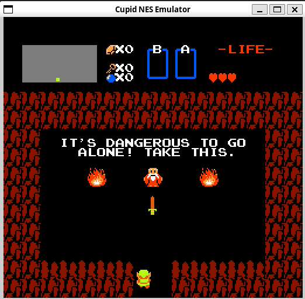

# Cupid NES Emulator

Cupid is an NTSC NES emulator written in C, with SDL2 for video, input, and audio.

<p align="center">
  
</p>
<p align="center">
  
</p>

## Build and run

### Linux

The build requires a C11 compiler, Make, and SDL2 development libraries. On Ubuntu:

```sh
sudo apt install build-essential libsdl2-dev
make
./cupid-nes path/to/game.nes
```

Clang is also supported: `make CC=clang`.

### Windows

Install Clang and the Windows SDK/MSVC build tools, then extract the SDL2 VC development package. From PowerShell in the repository root:

```powershell
.\scripts\test-windows.ps1 -SdlRoot C:\path\to\SDL2-2.32.10
.\build\windows\cupid-nes.exe C:\path\to\game.nes
```

The script builds the application and hardware tests, copies the SDL2 runtime beside the executables, and runs the regression suite. It accepts `-Compiler` to select another Clang executable and `-Sanitize` to build with AddressSanitizer and UndefinedBehaviorSanitizer. Sanitized binaries go in `build/windows-sanitized`.

## Hardware implementation

The CPU clocks the PPU, APU, and cartridge during each bus access. `cpu_step` returns elapsed CPU cycles after those devices have advanced; callers must not advance the PPU a second time.

The CPU core includes official and undocumented opcodes, page-crossing and read-modify-write bus accesses, interrupt polling, BRK vector hijacking, and JAM behavior. OAM and DMC transfers share the CPU bus, including halt, alignment, and overlap behavior. Controller reads preserve floating data lines and use the strobe and serial shift registers.

The PPU renders 256 by 240 pixels across 262 NTSC scanlines. Background and sprite pattern reads occur in their scheduled fetch slots. Sprite evaluation, overflow, clipping, priority, and sprite-zero hits use that pipeline. Register handling includes palette mirrors, buffered reads, open bus, rendering-time address increments, and vblank/NMI edge handling. Rendered odd frames skip one pre-render clock.

The APU implements two pulse channels, triangle, noise, and DMC. It includes envelopes, length and linear counters, sweep units, the four- and five-step frame sequences, frame and DMC interrupts, and nonlinear channel mixing. DMC reads are fulfilled through the CPU DMA engine. The triangle DAC retains its value when its sequencer stops.

### Cartridges

The loader reads iNES and NES 2.0 headers, checks payload lengths and size overflows, and handles trainers, CHR RAM, declared RAM capacities, and persistent memory. A failed load leaves the previous cartridge intact. Unsupported mapper numbers, submappers, and RAM layouts return an error.

| Mapper | Board family | Implemented behavior |
| --- | --- | --- |
| 0 | NROM | Fixed PRG/CHR mapping and header mirroring |
| 1 | MMC1 / SxROM | Serial banking, consecutive-write filtering, mirroring, outer PRG selection, and supported SOROM/SXROM RAM layouts |
| 2 | UxROM | Switchable 16 KiB PRG bank and fixed upper bank |
| 3 | CNROM | CHR bank selection |
| 4 | MMC3 / MMC6 | PRG/CHR banking, filtered PPU A12 IRQ clocks, and RAM protection; NES 2.0 submapper 1 selects MMC6 |
| 5 | MMC5, partial | PRG/CHR banking, banked RAM, ExRAM/fill nametables, multiplication, and scanline IRQ state |
| 7 | AxROM | 32 KiB PRG banking and single-screen mirroring |
| 9 | MMC2 | PRG banking and pattern-fetch CHR latches |
| 10 | MMC4 | PRG banking and pattern-fetch CHR latches |
| 11 | Color Dreams | PRG and CHR bank selection |
| 13 | CPROM | Banked CHR RAM |
| 15 | 100-in-1 | Address-selected PRG banking and mirroring |

Explicit NES 2.0 board variants include MMC1 submapper 5, MMC6 submapper 1, and UxROM/CNROM/AxROM submappers 1 and 2. Submapper 2 on those discrete boards enables ROM bus conflicts. An unspecified board variant does not identify every physical cartridge revision.

### Persistent memory

A battery-backed cartridge uses files beside its ROM:

| Memory | Example path for `game.nes` |
| --- | --- |
| PRG NVRAM | `game.sav` |
| CHR NVRAM | `game.chr.sav` |

Only declared nonvolatile memory is persisted. Save sizes follow the supported cartridge layout; the previous 8 KiB PRG save format remains usable for 8 KiB cartridges. Saves load when a cartridge opens and flush when it is replaced or the emulator exits normally.

For iNES headers, a zero PRG-RAM size means the conventional 8 KiB default. NES 2.0 declares volatile and nonvolatile RAM separately. The memory-loading API used by diagnostic tests does not create save files.

## Controls

| Key | Action |
| --- | --- |
| Z / X | A / B |
| Right Shift / Enter | Select / Start |
| Arrow keys | D-pad |
| R | Reset |
| F7 / F6 | Show palette editor / restore default palette |
| Ctrl+V | Paste palette text |

The existing palette editor also accepts dropped `.pal` files containing 192 or 1536 bytes. Its implementation remains in `src/ui/palette_tool.c`.

## Tests

Build and run the hardware regressions on Linux:

```sh
make test
```

The tests link the production CPU, PPU, APU, cartridge, and controller code. They cover instruction and bus behavior, DMA, interrupt edges, audio dividers and sequencers, graphics registers and fetch timing, cartridge banking, loader failures, and save persistence.

For the canonical CPU trace and external diagnostic ROMs, use the pinned test collection:

```sh
git clone https://github.com/christopherpow/nes-test-roms.git build/diagnostic-roms
git -C build/diagnostic-roms checkout 95d8f621ae55cee0d09b91519a8989ae0e64753b
python3 scripts/run-diagnostics.py build/accuracy-tests build/diagnostic-roms
```

On Windows, use `python` and `build/windows/accuracy-tests.exe`. The same script checks 8,991 canonical CPU states and runs 52 diagnostic ROMs, followed by five MMC3 diagnostics with explicit result-RAM initialization. It checks that every expected ROM is present and returns failure for a failed or unfinished run. The trace covers 225 opcode values; the hardware regression suite supplies additional opcode cases.

Individual runs are available through the test executable:

```sh
build/accuracy-tests --trace path/to/nestest.nes path/to/nestest.log
build/accuracy-tests --rom 7200 path/to/test.nes
build/accuracy-tests --render 240 path/to/test.nes build/test.ppm
```

The ROM runner recognizes the `DE B0 61` signature and status byte at `$6000`. A timeout, a reset request, or an absent result protocol is not a pass. Older tests that report only on screen need visual inspection. See [accuracy notes](docs/accuracy.md) for coverage and remaining limits.

GitHub Actions builds the emulator and tests with GCC and with Clang sanitizers, then runs the same pinned trace and ROM checks. The old `src/tests/cpu_test.c` harness is excluded because its writable-ROM assumptions do not match the cartridge bus.

## Scope

The target is the NTSC 2A03/2C02 system with standard controllers. PAL/Dendy timing, VS hardware, the Famicom Disk System, expansion controllers, and expansion audio are not implemented. MMC5 support is incomplete, including extended-attribute/vertical-split rendering and expansion sound. Other mapper families and unimplemented board variants remain unsupported.

Passing the listed tests does not establish complete hardware equivalence. Additional PPU register-pipeline behavior, power-on/reset details, analog effects, and uncommon DMA/mapper edge cases still need coverage. Unstable undocumented opcodes use a fixed silicon model.

## License and hardware documentation

GPL-3.0-or-later; see [LICENSE](LICENSE).

Hardware references: [NESdev](https://www.nesdev.org/wiki/Nintendo_Entertainment_System), [PPU](https://www.nesdev.org/wiki/PPU), [APU](https://www.nesdev.org/wiki/APU), and [mappers](https://www.nesdev.org/wiki/Mapper).
