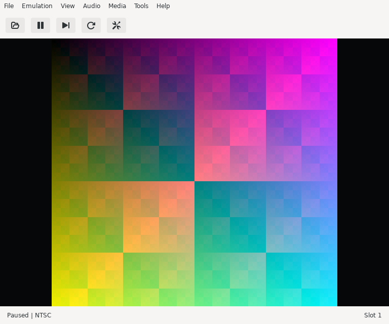
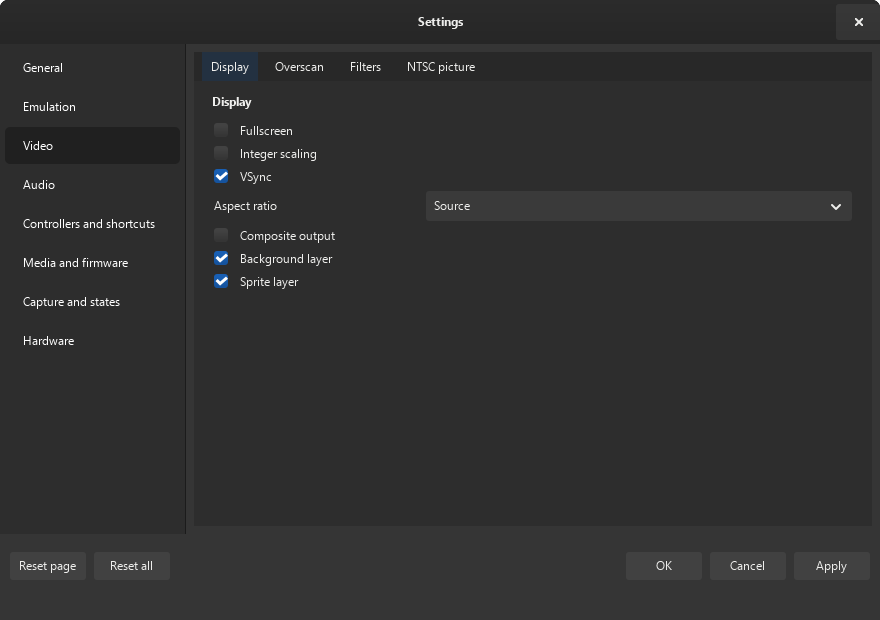
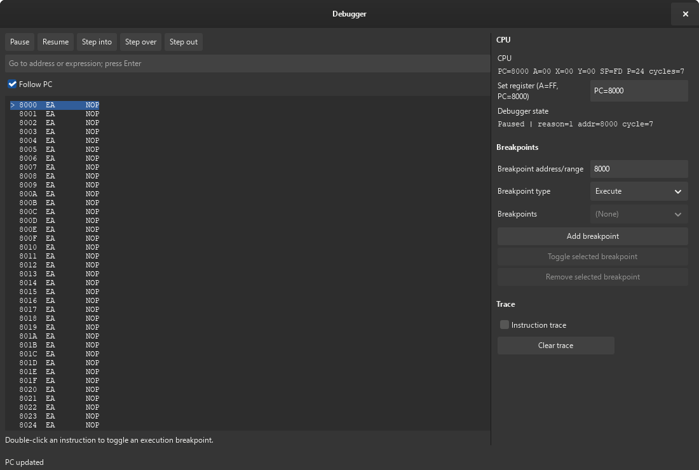
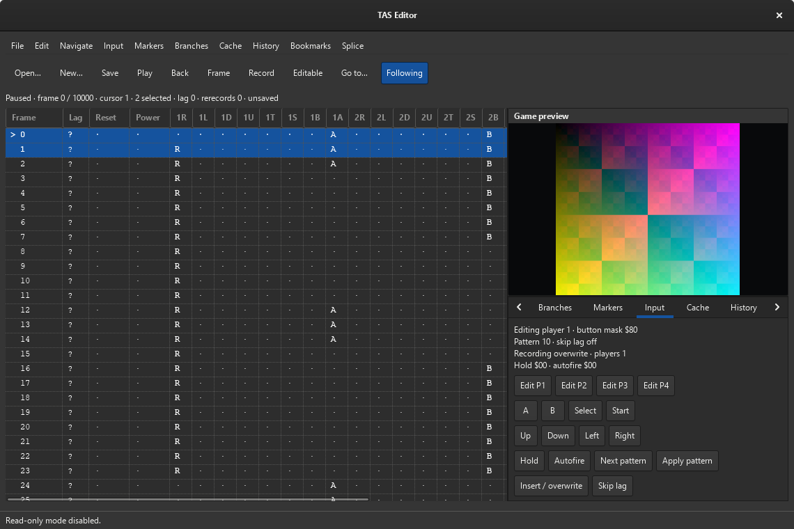

# Cupid NES

Cupid is an NES and Famicom emulator for Windows and Linux. It supports NTSC,
PAL, and Dendy timing, cartridge games, Disk System images, NSF/NSFe music,
StudyBox media, and supported VS System arcade images.

The GTK4 desktop has native menus, a compact toolbar, and separate windows for
settings and tools. Keep the debugger, memory editor, or TAS timeline beside the
game. Windows follows the system light or dark appearance.
Controls have no surrounding borders; keyboard focus stays visible in both themes.
The desktop paces emulation independently of expensive display updates. When
presentation falls behind, it shows the latest frame while preserving audio,
movie input, and captured frames. See [performance troubleshooting](docs/troubleshooting.md#slow-video-in-a-large-window).
Frame waits use the high-resolution clock and service pending desktop paints
between frames, including late frames and the final spin wait. With GTK 4.10
or later, Linux prepares an opaque texture for GPU rendering or a Cairo image
for software rendering. GTK 4.8 uses the Cairo drawing path. Windows uses an
accelerated SDL game viewport even when GTK uses Cairo for desktop widgets.
Game Information shows the game renderer and refreshes when a game is replaced
or unloaded.
GTK builds use a software SDL renderer and window surface for the hidden input
host. GTK renders the visible Linux window, and shader processing restores its
graphics context after loading, rendering, or releasing a preset. Explicit renderer overrides
remain available for troubleshooting.
Frame Timing Statistics reports emulation and display draw rates
separately, with interval jitter to help diagnose uneven motion.
The TAS editor reuses its grid drawing between changes. Follow Playback moves
directly to the current row, and live preview frames update without repeating
the window layout.



## Download and start

Get the Windows ZIP from [Releases](https://github.com/cupidthecat/cupid-nes/releases).
Extract it into a new folder and run `cupid-nes.cmd`. The package includes GTK and
its runtime libraries. Preview releases are available while the desktop changes
are under review.

Linux x64 previews are available as `cupid-linux-x64.tar.gz` for Ubuntu 24.04.
See [Linux download instructions](docs/getting-started.md#linux) for runtime dependencies.

Use **File > Open Game**, press **Ctrl+O**, or drop an image onto the game window.
Recent games remember archive members and patches. Opening another image switches
games in the same window; a failed load keeps the current session available.
Disk System and StudyBox images need their respective BIOS files.

## Settings and tools

Open **Settings** from the toolbar or press **Ctrl+Comma**. Choose a category on
the left. Video, audio, input, media, and hardware pages divide longer lists into
tabs. **Apply** saves validated changes; **Cancel** discards pending changes.
File fields have native pickers. Audio settings list detected output devices.
Controller choices remain automatic until explicitly selected. Saving other
preferences preserves automatic detection, and game-specific controller choices
stay with that game. See [configuration](docs/configuration.md) for saved settings.



Memory Search keeps results beside range and comparison controls. The debugger
places registers and breakpoints beside disassembly. The header editor separates
ROM, RAM, and console fields; format, mirroring, and region use named choices.



| Task | Tools and guide |
| --- | --- |
| Inspect code and memory | [Debugger, assembler, memory search, watches, hex editor, and PPU viewers](docs/debugging.md) |
| Analyze execution | [Coverage, profiles, events, symbols, source, traces, and text extraction](docs/debugger-tools.md) |
| Edit input movies | [TAS timeline, branches, markers, bookmarks, checkpoints, Lua, and splicing](docs/tas.md) |
| Manage cheats | [Cheat editor and Game Genie conversion](docs/cheats.md), [checksum-matched database](docs/cheat-database.md) |
| Change presentation | [Shader presets, HD drafts, frame timing, history, and audio output](docs/presentation-tools.md) |
| Record output | [Screenshots, WAV, raw or ZMBV AVI, animated GIF, and overlays](docs/capture.md) |
| Manage sessions | [Automatic resume, state recording, game settings, and update checks](docs/session-tools.md) |
| Edit cartridge metadata | [iNES and NES 2.0 header editor](docs/header-editor.md) |
| Use expansion input | [Controllers and peripherals](docs/controls.md), [Family BASIC keyboard](docs/keyboard.md) |

The cheat editor supports up to 256 codes per game. Saved lists preserve UTF-8
descriptions, and a rejected catalog import keeps the previous catalog available.

The TAS editor opens FM2 movies and FM3 projects. Its input grid sits beside a
resizable game preview and editing tabs. Save the full editing session as CTAS
or export a movie. The preview uses the same opaque game colors as the main view.
The converter handles supported power-on FCM movies after checking game identity.



These screenshots come from the native GTK regression application using a
generated diagnostic cartridge and input movie. The [desktop guide](docs/desktop.md)
explains the menus, individual windows, and settings.

## Default controls

| Key | Action |
| --- | --- |
| Z / X | A / B |
| Right Shift / Enter | Select / Start |
| Arrow keys | D-pad |
| Ctrl+O | Open a game |
| Ctrl+P / Ctrl+. | Pause or resume / advance one frame |
| Ctrl+R / Ctrl+Shift+R | Soft reset / power cycle |
| F5 / F6 | Save / load the selected state slot |
| F12 | Screenshot |
| Ctrl+F12 / Shift+F12 | Audio / video recording |
| Ctrl+Shift+F12 | Stop and finalize recording |

Settings can change keyboard and gamepad assignments and select another input
profile. The first SDL controller drives player 1 by default. See
[controls](docs/controls.md) for device-specific input and shortcut precedence.

## Build from source

The core uses C11, with C++17 cartridge modules and the EPSM sound engine.
GTK4 provides desktop widgets; SDL2 handles the emulation video pipeline, audio,
and controllers. Both a C and a C++ compiler are required.

On Ubuntu:

```sh
sudo apt install build-essential libgtk-4-dev libsdl2-dev libcurl4-openssl-dev
git clone https://github.com/cupidthecat/cupid-nes.git
cd cupid-nes
make -j4
./cupid-nes path/to/game.nes
```

On Windows, from the repository root:

```powershell
.\scripts\setup-gtk-windows.ps1
.\scripts\build-gtk-windows.ps1 -Jobs 8 -Package
Expand-Archive .\build\release\cupid-windows-x64.zip .\build\cupid-preview
.\build\cupid-preview\cupid-nes.cmd
```

Add `-Test` to run hardware regressions. `make GTK=0 test` builds the headless
regression suite. See [getting started](docs/getting-started.md) for toolchains,
output paths, Clang, and sanitizer builds.

## Hardware, saves, and accuracy

Cupid supports iNES, NES 2.0, and named UNIF boards. The optional `NesDB.txt`
database supplies legacy corrections and recognized headerless images. Explicit
command-line settings take precedence. The [hardware reference](docs/hardware.md)
lists mapper families, expansion sound, controller devices, supported layouts,
and remaining limits. Mapper support is not a per-game compatibility guarantee.

Cartridge saves normally live beside the ROM. Disk System writes default to a
separate IPS overlay. Quitting or replacing an image finalizes recordings and
persistent data first; failed writes leave the session available for retry.
The state recorder preserves existing snapshots when its history index cannot
be read and reports the problem before allowing another capture.
See [saves and media](docs/saves.md), [states and replay](docs/replay.md),
[netplay](docs/netplay.md), and [HD packs](docs/hd-packs.md).

The [recorded accuracy checkpoint](docs/accuracy-checkpoints.md#regional-timing-checkpoint)
passed all 144 AccuracyCoin tests with none skipped or unfinished, the 91-ROM
diagnostic collection, and the 8,991-state canonical CPU trace in normal and
sanitizer builds. Separate regressions cover mappers, storage, input, and
expansion audio. Results apply to the tested revision and configuration; see
[accuracy notes](docs/accuracy.md) for coverage and limits.

The [GTK workflow](.github/workflows/gtk-desktop.yml) checks settings transactions,
input handling, debugger and assembler edits, TAS interactions, window resizing,
and rendered screenshots. It also builds and checks the Windows package.
[Development and testing](docs/development.md) describes how to reproduce checks.

## Documentation and license

Start with the [documentation index](docs/README.md), [configuration reference](docs/configuration.md),
or [troubleshooting guide](docs/troubleshooting.md). See [support](SUPPORT.md) for
bug reports and [contributing](CONTRIBUTING.md) for changes.

Cupid is GPL-3.0-or-later; see [LICENSE](LICENSE). Imported components retain their
licenses, including [emu2413](src/rom/emu2413.LICENSE) and
[ymfm](src/third_party/ymfm/LICENSE). [Credits](docs/credits.md) lists component
attribution, diagnostic sources, and hardware references.
