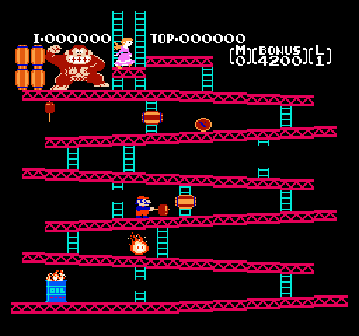

# Cupid NES Emulator

Cupid NES Emulator is a minimal NES emulator implemented in C. It is designed as a learning tool to explore the 6502 CPU architecture and basic NES hardware emulation. The project focuses on accurately emulating the CPU instruction set, various addressing modes, and simulating the NES memory map.

## 🎮 Major Milestone: Donkey Kong Playable!

**BREAKTHROUGH:** The emulator can now successfully run and play Donkey Kong! This represents a major achievement in NES emulation, demonstrating that the core CPU, PPU, and memory systems are working correctly enough to run one of the most iconic NES games.

<p align="center">
  
</p>

<p align="center">
  
</p>

This milestone validates:
- ✅ Complete 6502 CPU instruction set implementation
- ✅ Proper PPU background and sprite rendering
- ✅ Accurate memory mapping and ROM loading
- ✅ Working joypad input system
- ✅ Correct timing and interrupt handling
- ✅ Full NES hardware compatibility for classic games

## Features

### 6502 CPU Emulation

Implements a comprehensive 6502 instruction set including:

- **Data Transfer:** LDA, STA, TAX, TXA, LDY, LDX, STX, STY, LAX (undocumented)
- **Arithmetic:** ADC, SBC, INC, DEC, INX, INY, DEX, DEY
- **Logical:** AND, ORA, EOR, BIT
- **Comparison:** CMP, CPX, CPY
- **Branching:** BEQ, BNE, BCC, BCS, BMI, BPL, BVS, BVC
- **Jump/Call:** JMP (Absolute, Indirect), JSR/RTS, RTI
- **Stack Operations:** PHP/PLP, PHA/PLA, TSX/TXS
- **Shift/Rotate:** ASL, LSR, ROL, ROR
- **Undocumented Instructions:** DCP, RLA, SLO, SRE, RRA, SAX, ISC, SHX, SHY, SHA, TAS, LAS, and various undocumented NOPs
- **Control Flow:** BRK, NMI interrupt handling

### Multiple Addressing Modes

Supports all major 6502 addressing modes:

- Immediate
- Zero Page, Zero Page,X, Zero Page,Y
- Absolute, Absolute,X, Absolute,Y
- Indexed Indirect ((Indirect,X)) and Indirect Indexed ((Indirect),Y)
- Absolute Indirect (for JMP)
- Relative addressing for branch instructions
- Proper 6502 page-boundary crossing behavior and dummy reads

### Memory Map Simulation

- 2KB internal RAM with mirroring (0x0000–0x1FFF)
- PPU registers (0x2000–0x3FFF, mirrored every 8 bytes)
- APU/I-O registers (0x4000–0x401F)
- Joypad input (0x4016, 0x4017)
- PRG-RAM (0x6000–0x7FFF, 8KB)
- Program ROM (PRG-ROM) loaded into 0x8000–0xFFFF

### ROM Loading

Supports loading NES ROMs in the standard iNES file format. The loader extracts:

- PRG-ROM data (16KB per bank)
- CHR-ROM data (8KB per bank) or CHR-RAM if no CHR-ROM is present
- Mirroring mode (Horizontal/Vertical) based on header flags
- Automatic PRG-ROM mirroring for single-bank ROMs (NROM)

### PPU Emulation

- **VRAM and OAM:** Full PPU memory spaces with proper mirroring
- **PPU Registers:** Complete implementation of $2000–$2007 with proper scroll and address handling
- **OAM DMA:** Full 256-byte DMA transfer via $4014
- **Background Rendering:** Renders full 256×240 background using nametables, attribute tables, and pattern tables
- **Sprite Rendering:** Renders up to 64 sprites from OAM with proper palette lookup
- **VBlank Interrupt:** NMI generation at VBlank based on PPUCTRL bit 7
- **Palette Support:** Full 64-color NES palette with palette mirroring
- **Nametable Mirroring:** Configurable horizontal/vertical/single-screen mirroring modes
- **Scrolling:** Proper PPUSCROLL handling with fine X/Y and coarse coordinate management
- **Cycle Timing:** Approximate NTSC timing with VBlank scheduling

### Joypad Input

- Full controller support (A, B, Select, Start, Up, Down, Left, Right)
- Proper strobe and shift register behavior matching NES hardware
- SDL keyboard mapping for intuitive control

### Graphical Output

- Real-time rendering via SDL2
- Display of background and sprite layers
- 2x pixel scaling for better visibility

## Test Results

The emulator has been tested with various NES test ROMs to verify correct implementation of CPU instructions, PPU functionality, and overall emulation accuracy.

### CPU Tests

**Nestest Results**

<p align="center">
  
</p>

<p align="center">
  
</p>

The nestest ROM validates CPU instruction execution, addressing modes, and flag behavior. Both test screens show successful completion with all tests passing.

**CPU Execution Space Tests**

<p align="center">
  
</p>

This test verifies proper CPU execution in PPU I/O space, ensuring correct memory mapping and register behavior.

### PPU and Graphics Tests

**Color Test**

<p align="center">
  
</p>

The color test validates the PPU's palette rendering capabilities, showing proper color output and palette management.

**CLI Latency Test**

<p align="center">
  
</p>

This test verifies interrupt handling and timing accuracy, particularly for CLI (Clear Interrupt Disable) instruction behavior.

### Test ROMs Included

The project includes several test ROMs for validation:
- `nestest.nes` - Comprehensive CPU instruction testing
- `1-cli_latency.nes` - Interrupt timing validation
- `color_test.nes` - PPU color and palette testing
- `test_cpu_exec_space_ppuio.nes` - CPU execution in PPU I/O space
- `test_cpu_exec_space_apu.nes` - CPU execution in APU space

All tests demonstrate successful emulation of the NES hardware components.

## Project Structure

```
cupid-nes/
├── Makefile                 # Build configuration using gcc and SDL2
├── README.md                # Project documentation
├── include/
│   └── globals.h            # Global constants and shared definitions
└── src/
    ├── main.c               # Main emulation loop and SDL setup
    ├── cpu/
    │   ├── cpu.c            # 6502 CPU implementation with full instruction set
    │   └── cpu.h            # CPU interface and status flag definitions
    ├── ppu/
    │   ├── ppu.c            # PPU functionality, rendering, mirroring, and VBlank
    │   └── ppu.h            # PPU interface
    ├── rom/
    │   ├── rom.c            # ROM loading and iNES header parsing
    │   └── rom.h            # ROM interface and iNES header structure
    └── joypad/
        ├── joypad.c         # Joypad controller state management
        └── joypad.h         # Joypad interface
```

## Requirements

- **Compiler:** GCC (or any C compiler that supports C99)
- **Operating System:** Linux or any POSIX-compliant system
- **Build Tools:** Make
- **Libraries:** SDL2 (for graphical output)

## Installation & Usage

### Building the Emulator

From the root directory of the project, run:

```bash
make
```

This will compile all source files and create an executable named `cupid-nes`.

### Running with a ROM

To load and run an NES ROM:

```bash
./cupid-nes path/to/rom.nes
```

The emulator will:
- Load the ROM and print header information
- Initialize the CPU and PPU
- Open an SDL window and begin execution
- Display background and sprite graphics in real time

### Keyboard Controls

- **Z** – A button
- **X** – B button
- **Right Shift** – Select button
- **Enter** – Start button
- **Arrow Keys** – D-Pad (Up, Down, Left, Right)

## Emulation Details

### CPU Cycle Timing

The emulator approximates NTSC NES timing:

- CPU frequency: 1,789,773 Hz
- Frame rate: 60 Hz
- CPU cycles per frame: ~29,796
- Frames include a VBlank period where the PPU stops rendering

### Addressing Mode Implementation

The CPU includes proper 6502 quirks:

- Page-boundary crossing with dummy reads on indexed addressing modes
- 6502 indirect addressing bug in JMP (Absolute Indirect)
- Stack pointer wrapping at 0x00/0xFF
- Proper flag updates and preserved carry behavior in shift/rotate operations

### PPU Memory Management

- Nametable mirroring respects ROM configuration (horizontal/vertical)
- Palette RAM with special $3F10/$3F14/$3F18/$3F1C mirroring to $3F00
- Proper VRAM address latching for $2005 (scroll) and $2006 (address) writes
- Read buffer behavior for $2007 (palette reads bypass buffer)

## Limitations and Future Improvements

- **Mapper Support:** Currently supports NROM only. Additional mappers (MMC1, MMC3, etc.) would expand ROM compatibility
- **Cycle Accuracy:** Current timing is approximate; true cycle-accurate emulation would improve compatibility
- **Full APU Emulation:** Audio is not yet implemented
- **Debugging Tools:** An integrated debugger with breakpoints and memory inspection would aid development
- **Performance:** Further optimization for high-resolution or high-speed rendering

## Contributing

Contributions are welcome! To contribute:

1. Fork the repository
2. Create a feature branch for your changes
3. Test your implementation thoroughly
4. Submit a pull request with a detailed description
5. Update documentation as needed

## License

This project is open source under the GNU v3 License. See the [LICENSE](LICENSE) file for more details.

## Resources

- [NESdev Wiki](https://www.nesdev.org/wiki/Nintendo_Entertainment_System)
- [6502 CPU Documentation](http://www.6502.org/tutorials/6502opcodes.html)
- [SDL2 Documentation](https://wiki.libsdl.org/)
- [NES PPU Documentation](https://www.nesdev.org/wiki/PPU)
- [Undocumented 6502 Instructions](https://www.nesdev.org/undocumented_opcodes)
