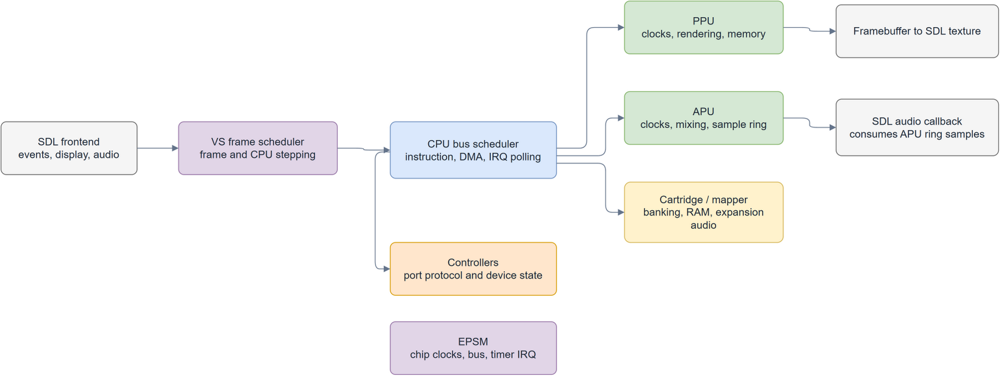
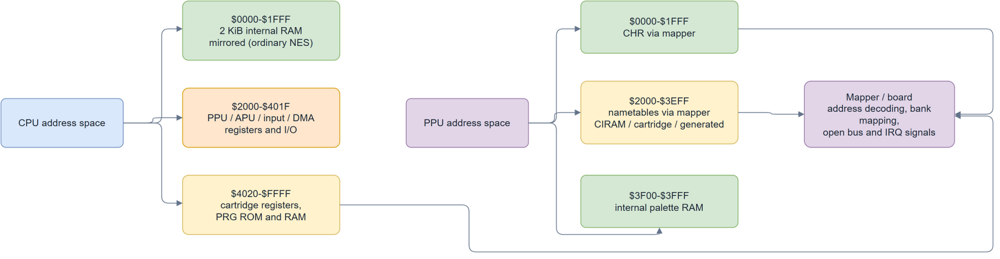
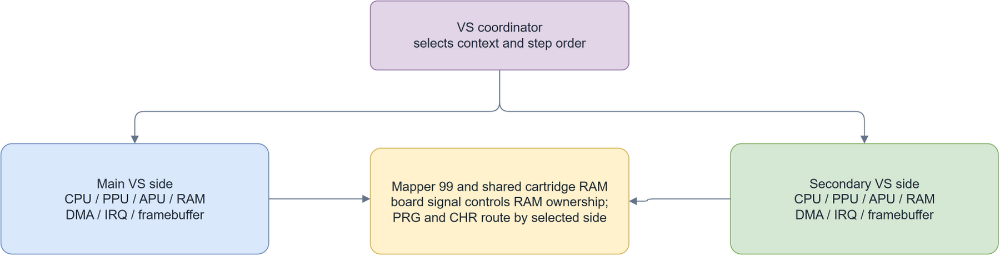

# Architecture

[Documentation index](README.md) | [Hardware reference](hardware.md)

Cupid has a C11 CPU/PPU core, an SDL frontend, and C++17 cartridge and EPSM sound modules. The application and hardware test executable link the same device implementations. The production core has global cartridge and timing state; the explicit machine contexts currently support the two VS sides, not arbitrary concurrent emulator instances.

## Source layout

| Path | Responsibility |
| --- | --- |
| [src/main.c](../src/main.c) | Startup, option parsing, SDL input, display, audio setup, pacing, and shutdown |
| [src/cpu](../src/cpu) | Instruction execution, CPU bus cycles, interrupt polling, and DMA arbitration |
| [src/ppu](../src/ppu) | Register behavior, rendering pipeline, sprite evaluation, PPU memory, and framebuffer writes |
| [src/apu](../src/apu) | Channel DAC latches, frame sequencer, DMC requests, sample production, and ring buffers |
| [src/apu/epsm.cpp](../src/apu/epsm.cpp), [src/third_party/ymfm](../src/third_party/ymfm) | EPSM bus, clock, firmware ownership, and YMF288 sound engine |
| [src/rom/rom.c](../src/rom/rom.c) | Image parsing, allocation, validation, and cartridge replacement |
| [src/media](../src/media) | Bounded ZIP/7z member selection, IPS/UPS/BPS patches, and image save identities |
| [src/rom/mapper.c](../src/rom/mapper.c) and its private `mapper_*.h` files | Shared cartridge state, board selection, banking, cartridge RAM, nametables, interrupts, and persistence |
| [src/rom/boards](../src/rom/boards), [board.h](../src/rom/board.h) | Cartridge board modules with owned RAM, 256-byte bus mappings, register decoding, and console reset hooks |
| [src/rom/fds.c](../src/rom/fds.c) | Disk image ownership, transport, registers, media writes, and disk audio |
| [src/rom/nsf.c](../src/rom/nsf.c) | NSF/NSFe parsing, banked program data, track metadata, and regional playback parameters |
| [src/ui/nsf_frontend.c](../src/ui/nsf_frontend.c) | Application track-key handling, reset sequencing, and audio-device locking |
| [src/rom/eeprom.c](../src/rom/eeprom.c) | Serial EEPROM state and transactions |
| [src/rom/namco163.c](../src/rom/namco163.c), [sunsoft5b.c](../src/rom/sunsoft5b.c), [vrc7_audio.c](../src/rom/vrc7_audio.c) | Expansion sound implementations and the FM wrapper |
| [src/joypad](../src/joypad) | Controller protocols, adapters, peripheral state, and Family BASIC keyboard/tape |
| [src/joypad/special_peripherals.c](../src/joypad/special_peripherals.c) | Turbo File/BattleBox storage, Subor input, trackball/tablet reports, specialty controllers, and Barcode Battler framing |
| [src/system](../src/system) | Region tables, console wiring selection, and VS machine coordination |
| [src/ui](../src/ui) | Palette editing and presentation helpers |
| [src/tests](../src/tests) | Hardware regressions, CPU trace comparison, and cartridge-driven diagnostics |
| [include/globals.h](../include/globals.h) | Shared framebuffer declarations and display dimensions |

Large C translation units use private implementation headers at existing subsystem boundaries. This keeps file size manageable while preserving private helpers and state. CPU opcode groups live beside `cpu.c`; mapper families live beside `mapper.c`; the larger PPU, input, and mapper regression groups live beside their test runners. Imported sound components retain their upstream file layout.

## From a frame to a bus access

Editable source: [architecture-flow.drawio](../img/architecture-flow.drawio). The diagrams use [drawio-skill](https://github.com/Agents365-ai/drawio-skill).

The main loop handles host events, starts a frame with `vs_start_frame()`, and calls `vs_cpu_step()` until the main PPU completes that frame. It then presents `vs_video_framebuffer()` and paces the next frame using elapsed emulated CPU time.

For an ordinary machine, the VS wrappers delegate to the main CPU and framebuffer. `cpu_step()` executes an instruction and advances the other devices during its bus operations. Its return value includes elapsed CPU time and DMA stalls. A caller must not use that count to advance the PPU, APU, mapper clocks, or DMA again.

CPU reads and writes occupy different master-clock phases. The scheduler carries the fractional PPU phase between accesses, which matters for PAL's 3.2:1 ratio. Each bus cycle advances the cartridge clock and APU once. Its two master-clock phases advance the PPU and active EPSM device. Interrupt polling includes APU, mapper, EPSM, and VS peer lines. OAM and DMC DMA use the same bus scheduler.

The CPU delays `$4016` output changes before delivering them to the controller layer. When the delay expires, EPSM samples the live external CPU data bus along with the output pins. Direct `$401C-$401F` writes use its other bus interface. These writes and timer IRQs are handled by the core even when no SDL audio device is open.

The [accuracy notes](accuracy.md) describe the exact register-delay and collision models. Changes to this path need bus-level tests because correct register values at an instruction boundary can conceal an incorrect access order.

## CPU and PPU memory

Editable source: [memory-routing.drawio](../img/memory-routing.drawio).

An ordinary cartridge uses 2 KiB internal CPU RAM with mirrors through `$1FFF`. The FamicomBox menu board supplies 8 KiB of distinct RAM over that range; loading an ordinary cartridge restores the 2 KiB mirrors. CPU `$2000-$3FFF` accesses reach mirrored PPU registers. APU, controller, and DMA registers occupy the CPU I/O range, while the cartridge layer handles board-specific registers and memory.

PPU pattern-table accesses reach CHR through the mapper. Nametable accesses go through `cart_nt_read()` and `cart_nt_write()` so boards can select CIRAM, cartridge memory, or generated data. Palette memory is internal to the PPU.

The cartridge bus API distinguishes a real byte from floating data lines. `cart_cpu_read_bus()` resolves those lines using the supplied bus latch; a particular byte value is not an open-bus sentinel. PPU address notifications and data reads are separate events, allowing A12-based IRQ logic to observe physical address changes without inventing extra reads.

Read and write decoding are independent. Jaleco 87/101/140 and Sunsoft 184 expose PRG RAM for reads at `$6000-$7FFF`, while writes there select banks. Trainers and save loading initialize RAM directly, so these boards can return stored data without accepting CPU writes to it. An explicit NES 2.0 no-RAM layout leaves reads on open bus while retaining register writes. [The mapper implementation](../src/rom/mapper.c) also keeps ROM bus conflicts separate from RAM writes.

JY boards can clock IRQs from CPU cycles, CPU writes, PPU A12 edges, or physical PPU reads. Fetch-source tags distinguish background and sprite pattern accesses for their extended CHR mode. Mapper 96 uses the address hook to latch an inner CHR bank when the bus enters `$2xxx` from another address range. Consecutive nametable accesses do not create a second entry edge.

## State and ownership

| State | Owner or access path |
| --- | --- |
| Loaded cartridge PRG/CHR buffers | Loader; mapper initialization borrows their storage |
| Mapper registers and work/save RAM | Cartridge layer; selected through global `cart` |
| FDS media, BIOS, RAM, and audio | Active `FdsImage` and disk-device state |
| NSF/NSFe metadata, playback program, bank registers, and expansion audio | Music parser and cartridge playback state in `nsf.c` and `mapper.c` |
| Ordinary CPU, PPU, and APU | Main machine globals and their runtime state |
| Secondary VS CPU/PPU/APU and framebuffer | Static secondary machine storage in `vs_system.c` |
| Host player button state | Controller layer, updated by frontend events |
| Specialty input reports and expansion storage | Controller layer and `special_peripherals.c`; the frontend supplies host input and storage paths |
| Audio producer/consumer positions | Atomic indices inside each APU ring buffer |
| EPSM chip, protocol, and copied ADPCM ROM | Active `EpsmDevice`, prepared before cartridge activation |

The loader validates sizes and supported combinations before replacing the active cartridge. `load_rom_memory()` copies the supplied image bytes but has no filename from which to derive save paths. `load_rom()` installs trainer bytes before loading persistent data from the image's save paths. Lower-level mapper initialization leaves the caller responsible for the PRG/CHR buffers it was given. The C++ board modules own their volatile RAM, nonvolatile RAM, and nametables separately from those ROM buffers. A prepared disk image transfers ownership when activation succeeds.

`nes_image_prepare()` reads a plain file or selected ZIP/7z member and applies an optional IPS, UPS, or BPS patch. Preparation leaves the active machine and its saves untouched. An archive with several supported images returns `NES_MEDIA_NEEDS_SELECTION`; `nes_image_list()` supplies the complete candidate list for the caller's picker. Preparation rejects corrupt data, unsafe or duplicate member names, unsupported compression, checksum failures, and limits above 256 MiB or 4,096 archive entries. Solid 7z blocks and decoder allocations are bounded as well.

`nes_image_load()` sends the prepared bytes through the cartridge, music, disk, or StudyBox loader. Cartridge database lookup, image identity, and hardware selection therefore use the resulting bytes after patching. Plain unpatched cartridge files keep their existing save names. Archives and patches derive a separate save stem from the container path, member name, patch checksum, and resulting image checksum. Disk images from archives or patches use an IPS save overlay and preserve the supplied source. BIOS ownership and hardware checks remain in the production loaders.

The frontend configures expansion-device storage separately through `joypad_persistent_configure()` after image loading. The cartridge loader resolves supported ordinary NES 2.0 default-input metadata before activation and applies the resulting controller configuration only after the new cartridge succeeds. Explicit adapter, port, and expansion choices override their corresponding automatic fields. VS input metadata has its own decoder. EPSM console metadata prepares a new device, including a copy of the configured percussion ROM, before cartridge activation.

`nes_set_region_mode()` stores the requested Auto, NTSC, PAL, or Dendy choice without changing a running machine. Each loader resolves the effective region before checking startup alignment and timing restrictions, then commits it with the replacement image. The override leaves the header or database timing declaration unchanged. The caller powers on the loaded CPU, PPU, and APU after a successful load; reset keeps the committed timing. A failed replacement preserves the previous timing and machine.

`rom_flush_persistent()` checks cartridge, disk, and input-device storage before an image replacement. `unload_rom()` performs the same check and returns false if a write fails, retaining the loaded machine and unwritten data. Callers must handle that result before destroying the only in-memory copy. Cartridge saves use the shared UTF-8 file layer and atomic replacement, including composite RAM and expansion-audio files. See [saves and media](saves.md) for the file layouts.

## Power-on and reset

Power-on and soft reset have separate APIs. The CPU reset sequence performs its bus reads, stack-pointer decrements, and vector reads. The PPU and APU each have state that resets and state that survives a soft reset; the tests and [accuracy notes](accuracy.md) define those choices.

The frontend's R handler resets the main PPU, APU, and CPU, then calls `vs_soft_reset()`. That entry point resets VS protection/control state for single systems and also resets the secondary machine for dual systems. PPU reset suppression preserves the running video state when selected. CPU reset sends separate reset and completion signals to the C++ cartridge board modules, which apply their board's latch behavior while retaining cartridge RAM. The C mapper initialization callbacks are still cartridge-insertion entry points. CPU power-on resets the active EPSM chip; CPU soft reset preserves it.

`cpu_soft_reset()` retains A, X, Y and CPU RAM, updates the status flags, decrements SP through the reset bus sequence, and reloads PC from the reset vector. It clears the latched mapper IRQ before those bus accesses. Retained cartridge counters continue clocking and can raise a new interrupt during reset. Callers reset the PPU and APU separately when they need a console reset. The APU clears its DAC latches and audio buffers on reset; its explicit soft-reset exceptions are in `apu_reset_state()`.

Hardware-profile choices live outside the state cleared by power/reset operations. Do not replace a soft reset with a full structure clear merely to make a test fixture easier to initialize.

NSF and NSFe use the production CPU and sound chips with a small playback program and a CPU-cycle timer. Their PPU advances frame timing without rendering or VBL NMIs, and their base-APU frame/DMC IRQs are masked. Music resets always reset that timing state, including when cartridge PPU reset suppression is enabled. Application track keys hold the audio-device lock while clearing and restarting the music state. Loading a cartridge restores ordinary PPU and APU interrupt behavior.

## Dual VS execution

Editable source: [dual-vs.drawio](../img/dual-vs.drawio).

The secondary side has independent CPU RAM, bus latches, interrupt and DMA state, PPU memory and rendering state, and an APU. The scheduler selects the appropriate context while stepping each CPU. It advances the secondary CPU when the main side is more than five CPU cycles ahead or has advanced to a later frame, then restores the main selection.

Instruction stepping is sequential on the emulation thread. The context selectors are not synchronization primitives for running two cores on separate threads. Mapper 99 routes PRG/CHR according to the selected side and enforces shared-RAM ownership; controller reads route host players 3/4 to the secondary side.

Video composition copies the two completed 256-by-240 images into a 512-by-240 image for the frontend. Normal configurations return the main framebuffer directly.

## Audio threading

The emulation thread generates samples into each APU's ring. Pulse and noise channels store the last value driven to their DACs. Timer edges update these latches; pulse-register writes also refresh pulse output. Clearing a channel's length counter through `$4015` leaves its preceding output until the next channel edge. Optional CPU test reads at `$4018-$401A` and the mixer use the same channel outputs.

Each CPU-cycle output change is evaluated through the nonlinear APU mixer and recorded as a delta in the band-limited reconstruction buffer. Register writes can add transitions at the current timestamp between clocks. Mapper expansion sound enters this path through `cart_expansion_audio()`. The reconstructed host-rate samples then pass through the existing analog output filters. EPSM stereo samples are added after those filters, then the result is clipped and stored as middle and side values. The SDL callback consumes samples using atomic read/write indices. In dual mode, the callback averages samples from stable main and secondary APU storage; it never selects a CPU machine context.

Both APUs are initialized to the opened audio device's sample rate. Underruns use the last sample consumed by that callback, held in consumer-owned state. This avoids reading the producer's changing filter output as a fallback.

EPSM runs on the emulation thread from CPU master-clock advances. It generates YMF288 samples every 144 chip clocks and interpolates them into the APU's sample cadence. Middle and side values are published together through the same atomic write index. The stereo callback reconstructs each pair without accessing chip state. Ordinary NES and dual VS output remain mono. The frontend requests 44,100 Hz float audio, with two channels for EPSM and one for other configurations.

The frontend locks the audio device while resetting APU state and closes it before unloading the machine. Each APU owns its reconstruction allocation: reset clears its history, while `apu_audio_shutdown_state()` releases it before machine storage is discarded or reused. Any frontend that replaces a running machine must stop callback access before changing its storage or configuration. Source links: [APU output](../src/apu/apu.c), [VS audio coordination](../src/system/vs_system.c), and [frontend lifecycle](../src/main.c).

## Adding coverage

Tests link the production sources listed in [Makefile](../Makefile) and [the Windows build script](../scripts/test-windows.ps1). The test executable supplies the framebuffer and initial controller globals that the frontend normally owns. Synthetic cartridges can therefore run real CPU programs through the normal bus and device paths without opening a game window.

For an implementation change, follow [development and testing](development.md) and [the contribution guide](../CONTRIBUTING.md). Keep helper-only checks for narrow units; use production loader and CPU-bus tests when the behavior depends on timing, cartridge activation, DMA, or cross-device state.
