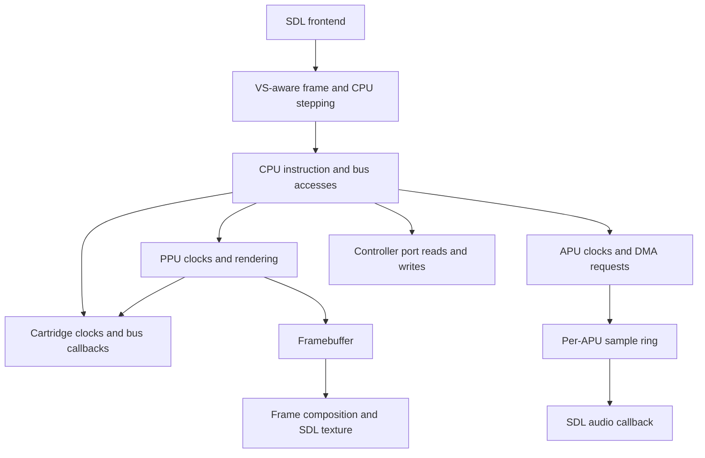

# Architecture

[Documentation index](README.md) | [Hardware reference](hardware.md)

Cupid is a C11 emulator with an SDL frontend. The application and hardware test executable link the same device implementations. The production core has global cartridge and timing state; the explicit machine contexts currently support the two VS sides, not arbitrary concurrent emulator instances.

## Source layout

| Path | Responsibility |
| --- | --- |
| [src/main.c](../src/main.c) | Startup, option parsing, SDL input, display, audio setup, pacing, and shutdown |
| [src/cpu](../src/cpu) | Instruction execution, CPU bus cycles, interrupt polling, and DMA arbitration |
| [src/ppu](../src/ppu) | Register behavior, rendering pipeline, sprite evaluation, PPU memory, and framebuffer writes |
| [src/apu](../src/apu) | Audio channels, frame sequencer, DMC requests, sample production, and ring buffers |
| [src/rom/rom.c](../src/rom/rom.c) | Image parsing, allocation, validation, and cartridge replacement |
| [src/rom/mapper.c](../src/rom/mapper.c) | Board selection, banking, cartridge RAM, nametables, interrupts, and persistence |
| [src/rom/fds.c](../src/rom/fds.c) | Disk image ownership, transport, registers, media writes, and disk audio |
| [src/rom/eeprom.c](../src/rom/eeprom.c) | Serial EEPROM state and transactions |
| [src/rom/namco163.c](../src/rom/namco163.c), [sunsoft5b.c](../src/rom/sunsoft5b.c), [vrc7_audio.c](../src/rom/vrc7_audio.c) | Expansion sound implementations and the FM wrapper |
| [src/joypad](../src/joypad) | Controller protocols, adapters, peripheral state, and Family BASIC keyboard/tape |
| [src/system](../src/system) | Region tables, console wiring selection, and VS machine coordination |
| [src/ui](../src/ui) | Palette editing and presentation helpers |
| [src/tests](../src/tests) | Hardware regressions, CPU trace comparison, and cartridge-driven diagnostics |
| [include/globals.h](../include/globals.h) | Shared framebuffer declarations and display dimensions |

## From a frame to a bus access

The main loop handles host events, starts a frame with `vs_start_frame()`, and calls `vs_cpu_step()` until the main PPU completes that frame. It then presents `vs_video_framebuffer()` and paces the next frame using elapsed emulated CPU time.

For an ordinary machine, the VS wrappers delegate to the main CPU and framebuffer. `cpu_step()` executes an instruction and advances the other devices during its bus operations. Its return value includes elapsed CPU time and DMA stalls. A caller must not use that count to advance the PPU, APU, mapper clocks, or DMA again.

CPU reads and writes occupy different master-clock phases. The scheduler carries the fractional PPU phase between accesses, which matters for PAL's 3.2:1 ratio. Interrupt lines are sampled at the CPU polling boundaries. OAM and DMC DMA share the bus scheduler rather than bypassing instruction timing.

The [accuracy notes](accuracy.md) describe the exact register-delay and collision models. Changes to this path need bus-level tests because correct register values at an instruction boundary can conceal an incorrect access order.

## CPU and PPU memory

The CPU has 2 KiB internal RAM with mirrors through `$1FFF`. CPU `$2000-$3FFF` accesses reach mirrored PPU registers. APU, controller, and DMA registers occupy the CPU I/O range, while the cartridge layer handles board-specific registers and memory.

PPU pattern-table accesses reach CHR through the mapper. Nametable accesses go through `cart_nt_read()` and `cart_nt_write()` so boards can select CIRAM, cartridge memory, or generated data. Palette memory is internal to the PPU.

The cartridge bus API distinguishes a real byte from floating data lines. `cart_cpu_read_bus()` resolves those lines using the supplied bus latch; a particular byte value is not an open-bus sentinel. PPU address notifications and data reads are separate events, allowing A12-based IRQ logic to observe physical address changes without inventing extra reads.

## State and ownership

| State | Owner or access path |
| --- | --- |
| Loaded cartridge PRG/CHR buffers | Loader; mapper initialization borrows their storage |
| Mapper registers and work/save RAM | Cartridge layer; selected through global `cart` |
| FDS media, BIOS, RAM, and audio | Active `FdsImage` and disk-device state |
| Ordinary CPU, PPU, and APU | Main machine globals and their runtime state |
| Secondary VS CPU/PPU/APU and framebuffer | Static secondary machine storage in `vs_system.c` |
| Host player button state | Controller layer, updated by frontend events |
| Audio producer/consumer positions | Atomic indices inside each APU ring buffer |

The loader validates sizes and supported combinations before replacing the active cartridge. `load_rom_memory()` copies the supplied image bytes. Lower-level mapper initialization leaves the caller responsible for the PRG/CHR buffers it was given. A prepared disk image transfers ownership when activation succeeds.

`unload_rom()` returns a boolean. Dirty FDS media that cannot be saved leaves the device loaded and returns false. Callers must handle that result before destroying the only in-memory copy. [Saves and media](saves.md) distinguishes this from ordinary cartridge persistence.

## Power-on and reset

Power-on and soft reset have separate APIs. The CPU reset sequence performs its bus reads, stack-pointer decrements, and vector reads. The PPU and APU each have state that resets and state that survives a soft reset; the tests and [accuracy notes](accuracy.md) define those choices.

The frontend's R handler resets the main PPU, APU, and CPU, then calls `vs_soft_reset()`. That entry point resets VS protection/control state for single systems and also resets the secondary machine for dual systems. It is not a general call to every mapper's power-on routine.

Hardware-profile choices live outside the state cleared by power/reset operations. Do not replace a soft reset with a full structure clear merely to make a test fixture easier to initialize.

## Dual VS execution

The secondary side has independent CPU RAM, bus latches, interrupt and DMA state, PPU memory and rendering state, and an APU. The scheduler selects the appropriate context while stepping each CPU. It advances the secondary CPU when the main side is more than five CPU cycles ahead or has advanced to a later frame, then restores the main selection.

Instruction stepping is sequential on the emulation thread. The context selectors are not synchronization primitives for running two cores on separate threads. Mapper 99 routes PRG/CHR according to the selected side and enforces shared-RAM ownership; controller reads route host players 3/4 to the secondary side.

Video composition copies the two completed 256-by-240 images into a 512-by-240 image for the frontend. Normal configurations return the main framebuffer directly.

## Audio threading

The emulation thread generates samples into each APU's ring. Mapper expansion sound enters the APU sample path through `cart_expansion_audio()` before post-filtering. The SDL callback consumes samples using atomic read/write indices. In dual mode, the callback averages samples from stable main and secondary APU storage; it never selects a CPU machine context.

Both APUs are initialized to the opened audio device's sample rate. Underruns use the last sample consumed by that callback, held in consumer-owned state. This avoids reading the producer's changing filter output as a fallback.

The frontend locks the audio device while resetting APU state and closes it before unloading the machine. Any future frontend that replaces a running machine must likewise stop callback access before changing its storage or configuration. Source links: [APU output](../src/apu/apu.c), [VS audio coordination](../src/system/vs_system.c), and [frontend lifecycle](../src/main.c).

## Adding coverage

Tests link the production sources listed in [Makefile](../Makefile) and [the Windows build script](../scripts/test-windows.ps1). The test executable supplies the framebuffer and initial controller globals that the frontend normally owns. Synthetic cartridges can therefore run real CPU programs through the normal bus and device paths without opening a game window.

For an implementation change, follow [development and testing](development.md) and [the contribution guide](../CONTRIBUTING.md). Keep helper-only checks for narrow units; use production loader and CPU-bus tests when the behavior depends on timing, cartridge activation, DMA, or cross-device state.
