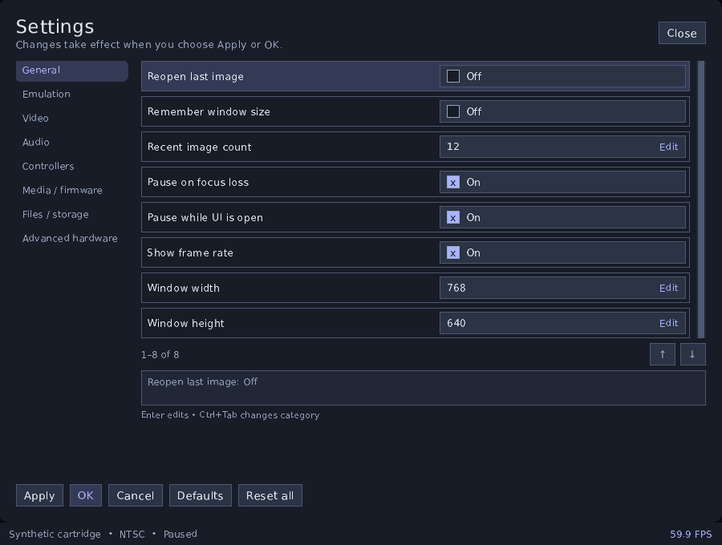
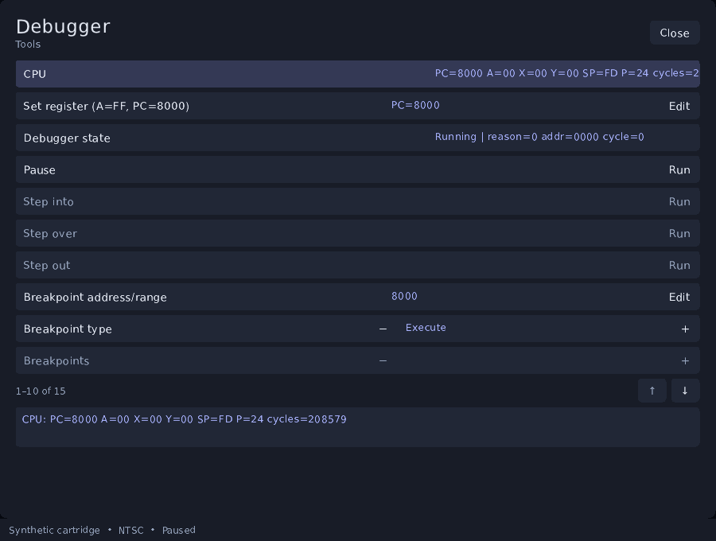
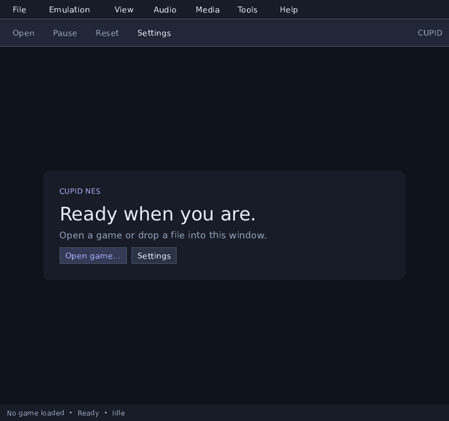
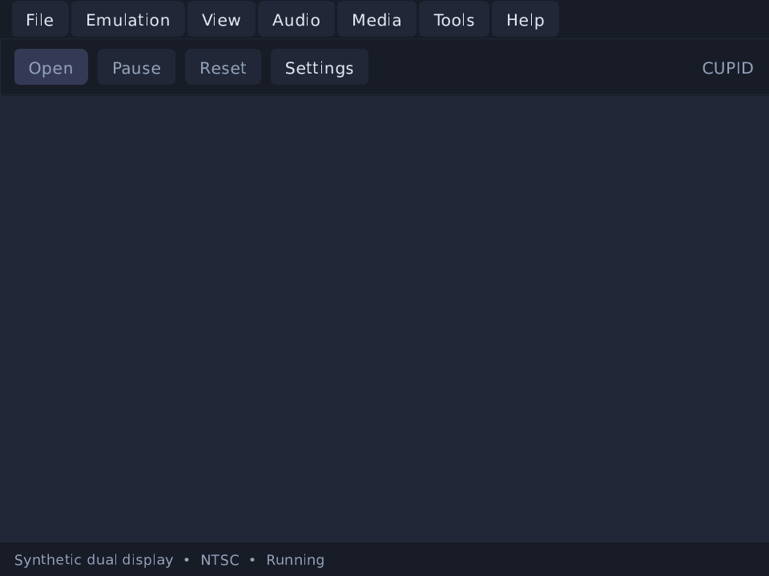
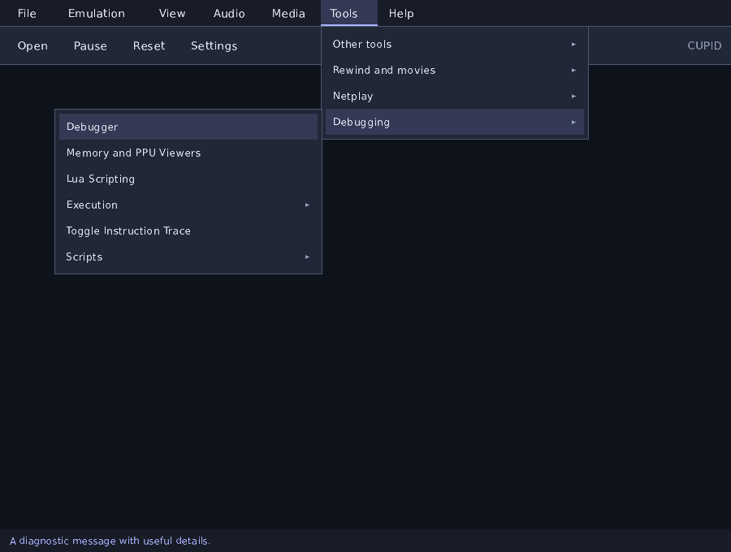

# Desktop interface

[Documentation index](README.md)

Launch Cupid without an image to open the startup window. Use Open, press
Ctrl+O, drop a game image, or select a recent entry. Recent entries retain the
archive member, patch, firmware selection, and save identity needed to reopen
that image. A failed replacement leaves the current machine available.

The top menu bar contains File, Emulation, View, Audio, Media, Tools, and Help.
A separate toolbar below it provides Open, Pause/Resume, Reset, and Settings.
Commands are grouped into submenus, with at most ten entries per menu. Hover
over a group or press Right to open it; Left or Escape returns to its parent.
Alt+F opens the menu bar, arrow keys move the selection, and Enter activates it. The
status bar shows the title, effective region, execution state, active capture
or movie, and disk activity where applicable. Netplay supplies its connection
status while listening or connected.

The startup screen, menus, settings, feature panels, palette editor, and text
entry use Clay layouts with cached TrueType text. Controls follow the layout
when the window or display scale changes. No separate font installation is
needed.

Settings, game information, the palette editor, and feature panels open in separate native windows.
Use the operating system's window frame to close or resize them, or drag the title bar to move them beside the game or onto another display.
Opening a debugger or inspection tool leaves emulation running. A breakpoint,
Pause, or a stepping command can still stop it. Moving focus between Cupid
windows does not trigger the pause-on-focus-loss preference. Each tool shows
the active game, region, and execution state in its status bar, and its FPS
counter uses the game window's measurement. These values follow game changes
while the tool remains open.

File controls in tool windows also open native choosers. Scripts, cheat files,
and databases use an Open dialog; state, movie, tape, and capture destinations
use a Save dialog. Existing Load and Save actions remain available for choosing
an input or output file. HD packs offer both a ZIP picker and a folder picker.

Tools > Debugging > PPU tools opens graphical pattern, nametable, sprite, palette,
register, VRAM, and tile windows. See [visual PPU tools](debugging.md#visual-ppu-tools)
for inspection controls and editing limits.

Tools > Debugging > 6502 Assembler previews one instruction, its generated
bytes, and the mapped write target. Pause the game to apply it to writable RAM.
See [inline assembler](debugging.md#inline-assembler) for operand syntax and
the rules for editing a running session.

## Game Genie utility

Tools > Cheats > Game Genie converts between six- or eight-letter codes and
hexadecimal address, value, and compare fields. Edit a field and press Enter
to update the others. Addresses must be 8000 through FFFF; values and compare
bytes must be 00 through FF. Leave Compare blank for a six-letter code. Letter
input is case-insensitive, and the utility displays the canonical uppercase
code. Invalid entries leave the previous result intact.

Copy code copies the result to the clipboard. With a game open, Send to cheat
editor opens Cheats with a new draft and its description. Review it and select
Add new cheat to activate it. Conversion itself does not change active cheats,
and movie recording, playback, and netplay retain their normal restrictions on
cheat changes.

## Settings

Ctrl+Comma opens Settings. The eight categories cover General, Emulation,
Video, Audio, Controllers, Media and firmware, Files and storage, and Advanced
hardware. Up/Down selects a row; Left/Right adjusts its value. Ctrl+Tab changes
categories; Tab moves among rows, buttons, and the category list. Click a
checkbox to toggle it, a choice field to open its options, or Edit to enter a
number or text. Enter opens the selected control and saves an edit. Numeric
fields accept custom values, such as 1.25 for speed or 44100 for sample rate.
Invalid entries stay open with their allowed range shown. Text fields start with their contents selected;
typing replaces them. Ctrl+A selects all, Ctrl+C copies the selection, Ctrl+V
pastes, and End lets you append. Escape cancels an edit or closes the
window. File paths have a Browse button that opens a native file dialog;
F4 also opens it for the selected row. Use Clear to unset an optional path.
Canceling the chooser preserves the previous value. Audio > Output device
lists the detected playback devices and System default. Lists scroll to keep
the selected row visible. Scrollbars show the position and can be dragged; the
wheel and arrow controls also move through rows.

Apply validates and saves changes while leaving the window open. OK applies
and closes it. Cancel discards unapplied edits. Defaults resets the current
category; Reset all requires a second activation before replacing the staged
settings. Explicit launch options retain precedence over saved preferences.
The settings window indicates when those overrides are present.

Display, mixing, speed, and binding changes apply to the running session.
Video > Bilinear interpolation smooths the game texture as it scales to the
window. It is off by default, which keeps nearest-neighbor sampling. The
setting also applies to composite and HD output. PPU inspection textures keep
their own exact-pixel rendering. Interpolation does not change screenshot or
recording dimensions, overscan, or light-gun coordinates. Apply updates the
display even while emulation is paused.

Video > Pixel filter offers xBRZ at 2x through 6x; HQ2x, HQ3x, and HQ4x;
Scale2x, Scale3x, and Scale4x; 2xSaI, Super2xSaI, and SuperEagle; and integer
prescaling at 2x, 3x, 4x, 6x, 8x, and 10x. Use Next in the option picker for
the final prescale choices. Prescaling repeats pixels without changing their
colors. The other scalers use neighboring pixels to smooth edges. All filters
operate after cropping and optional composite or HD rendering, with each VS
screen processed independently. Their output dimensions are the incoming
dimensions multiplied by the selected factor. Integer window scaling applies
to that output; a smaller window fits the whole image at a fractional scale.

LCD Grid expands each displayed pixel into four cells.
The top-left cell defaults to 100% brightness; the other three default to 85%.
Each LCD brightness field accepts 0 through 100%. Choose None to return to
direct output. The filter follows overscan, layer selection, composite, and HD
rendering. Displayed-output screenshots and recordings include its cells at
twice the incoming width and height; raw captures keep the original pixels.
Window stretching and bilinear interpolation happen after this capture stage.
The filter keeps the two VS screens separate and preserves light-gun mapping.
Outputs above 8192 pixels in either dimension or 256 MiB are rejected with an
error, and a failed Apply restores the previous filter and texture.

Enable Video > NTSC composite to use the picture controls. The presets are
Default composite, Sharp composite, Soft television, and Monochrome. Choosing
a preset replaces all ten picture controls; editing one displays Custom.
Apply updates a paused picture too, and Cancel keeps the applied settings.

Hue accepts -180 through 180 degrees; brightness accepts -100 through 100%.
Contrast and saturation accept 0 through 200%, with 100% as neutral. Contrast
at zero produces black; saturation at zero produces grayscale. Luma filter
width accepts 1 through 96 signal samples, while the I and Q chroma widths
accept 12 through 96. Larger widths blur horizontal detail or color. These
widths control resolution and color bleed rather than adding separate
artifact or fringing controls that the decoder cannot independently model.

Gamma accepts 25 through 400%, with 100% leaving the decoded levels unchanged.
Larger values brighten intermediate levels. Scanline strength accepts 0 through
100% and dims every second output row; zero leaves both rows equal. Follow PPU
phase uses the frame's carrier phase. Fixed phase always decodes phase zero.
Blend three phases averages three reconstructions of the same signal before
gamma and scanline dimming; it does not blend previous emulated frames.

The default picture uses hue and brightness zero, contrast and saturation
100%, all three filter widths 36 samples, gamma 100%, scanlines zero, and
Follow PPU phase. Picture controls retain the 512 by 480 composite dimensions
before cropping and later filters. They apply to displayed captures but leave
raw captures, PPU pixels, emulation timing, and light-gun sensing unchanged.
PAL, Dendy, and VS output bypass composite reconstruction and its controls.

Rewind speed selects 1 through 30 retained frames per step. Holding the rewind
binding repeats steps at the emulated frame rate. A menu step pauses on the
restored frame; Resume continues from there. Applying unrelated settings keeps
the retained history.
Timing changes take effect on reload; startup alignment, RAM initialization,
and VS DIP changes take effect on power cycle. Firmware changes require a
restart. The application reports these boundaries after Apply. Invalid firmware,
conflicting connectors, failed output paths, or a failed settings write keep
the preceding configuration. Stop a deterministic session before applying
settings, and stop recording before changing its output configuration.

Text entry and dialog navigation are captured by the interface. They do not
reach the game. Leaving the game window releases held keyboard input. Controller removal
releases that player's held buttons. Mouse aiming uses the actual game rectangle
after menus, aspect scaling, overscan, HD rendering, and dual-display layout.



## Feature panels

| Task | Location |
| --- | --- |
| Save slots and state files | File > Save states; Tools > Storage |
| Rewind, run-ahead, input movies | Tools > Rewind and movies |
| Direct network sessions | Tools > Netplay |
| Breakpoints, registers, memory, hardware inspection, Lua | Tools > Debugging |
| Cheat list and code entry | Tools > Cheats |
| Track selection, playback, repeat, shuffle | Tools > Music player |
| Disk sides, insertion, write protection, tape, barcodes, cabinet input | Media device panels |
| PNG screenshots, WAV audio, AVI video | Capture panel |
| Replacement graphics/audio, pack install/export/capture | Tools > HD graphics |
| Effective paths, database selection, cartridge header editor | Tools > Storage |
| Per-game settings, recovery snapshots, session restore | Tools > Game and recovery |
| Virtual keyboard | Tools > Input tools, or Media when registered as a media panel |
| Shader presets, native audio output, frame timing, CPU overclock | Tools > Picture, sound and timing |
| Command-line reference and update panel | Tools > Application; related commands also appear under Help |
| Loaded image and effective hardware | Help > Game information |
| Recent application errors and notices | Help > Recent messages |

Tool categories appear only when their commands or panels are registered.
Large menus use nested pages sized to the available window height. Root pages
show their first and last category names. Left returns to the previous level;
Right or Enter opens the selected category or page. Disabled entries remain
visible so their location does not change when a game is unloaded.

At 900 by 680 pixels, the menu bar fits at 100%, 150%, and 200% UI scaling.
Short settings windows use a compact category list and show fewer settings
rows. The option picker keeps its twenty-choice pages and reduces row spacing
in short windows so Previous and Next remain visible.

Panels use Up/Down or Tab to select a row and Enter to activate it. Text rows
accept paths or values, and choice fields open an option list. Lists with more
than twenty choices have Previous and Next pages. Long panels and the message
log have visible scrollbars. A disabled action belongs to hardware or a session that is unavailable;
clicking an unavailable menu item explains the requirement. Disk commands need
a loaded FDS image; tape commands need the Family BASIC keyboard selected as
the expansion device. Click an action row or its Run button. Checkboxes toggle
on click, and Edit opens text entry. Long values stay within their
columns, with the selected value shown below the rows.

Tools > Cheats > Add cheat opens a code editor. Invalid codes remain in the
editor with an error beside the input. Load cheat file, Save cheat file, and
Load Lua Script open file choosers. Canceling a chooser leaves the active
cheats or script unchanged.

View > Palette > Palette editor (F7) opens a separate window with all 64 colors. Select a swatch, drag an RGB
slider, or use its minus/plus buttons. Load palette opens a `.pal` file; Reset
palette restores the default colors. Ctrl+V accepts palette text while the
editor is open. Escape or Close returns to the game.



## Frame and audio performance

Settings and menus follow the pause-on-UI preference. This automatic pause is
separate from manual pause, so closing a window or returning from another app
does not undo a manual pause. Returning to the game resets its pacing deadline
and audio output buffer. Selecting a speed ends held or toggled fast-forward;
VSync is suspended at speeds other than 100%. Tool windows refresh at most
30 times per second and do not wait for VSync.

Rewind snapshots lock audio state briefly without pausing and restarting the
output device every frame. Snapshot checksums process eight bytes at a time;
the saved-state format and checksum value are unchanged. The desktop caches
glyphs in a texture atlas instead of drawing each character as individual
pixel rectangles. The FPS counter measures completed emulated frames over
elapsed wall time, including pacing delays.

To measure uncapped frontend work with a local ROM:

```powershell
.\build\windows\accuracy-tests.exe --benchmark-frontend 600 "C:\Games\game.nes"
```

This diagnostic measures 600 frames with rewind disabled and with ten seconds
of history configured, then times the desktop renderer separately. It uses
SDL's dummy audio/video drivers and a software renderer. It does not write
cartridge saves, measure display latency, or establish how a physical audio
device sounds. Run it without other heavy work for a useful comparison.

Storage locations shows the configuration directory, cartridge save identity,
disk overlay, state and movie paths, three capture paths, current patch, HD root,
and database. Browse changes supported output or database paths; Open Folder
opens the effective directory. Cartridge identities and active disk overlays are
read-only here. Use `--data-dir` at launch to select a different application data
root. Existing saves are not relocated or deleted by an output-path change.

## Rendered examples and validation

These images come from the production SDL renderer driven by the desktop
regression harness. They use synthetic session labels and contain no game ROM
artwork. They are automated render checks, not records of manual desktop use.







[Option list with pages](images/desktop-choices.png) · [Cheat validation](images/desktop-cheat-validation.png)

[Palette editor](images/desktop-palette.png) · [Text entry](images/desktop-text-entry.png)

| Category | Render |
| --- | --- |
| General | [View](images/desktop-category-0.png) |
| Emulation | [View](images/desktop-category-1.png) |
| Video | [View](images/desktop-category-2.png) |
| Audio | [View](images/desktop-category-3.png) |
| Controllers | [View](images/desktop-category-4.png) |
| Media and firmware | [View](images/desktop-category-5.png) |
| Files and storage | [View](images/desktop-category-6.png) |
| Advanced hardware | [View](images/desktop-category-7.png) |

The event tests cover keyboard navigation, category defaults and cancellation,
every settings row and choice, custom numeric validation, scrollbar dragging,
nested menu reachability, paged choices, cheat validation and file selection,
mouse targets at three scales, palette changes, text replacement,
window-close events during dialogs, uninterrupted audio-device state during
snapshot locks, settings-write rollback, storage selection, tape
transport, and barcode input. Render checks exercise [100%](images/desktop-settings.png),
[150%](images/desktop-settings-150.png), and [200%](images/desktop-settings-2x.png) layout
and game rectangles. Run just the desktop checks with
`accuracy-tests --desktop`. The broader hardware suite covers regional and dual-system
execution. Manual Windows/Linux checks with physical controllers, native file
dialogs, display-DPI changes, and representative games remain separate acceptance
work; automated rendering does not establish those results.
