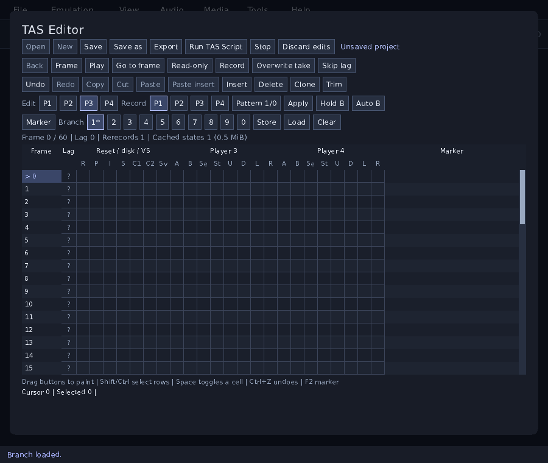

# TAS movies and editing

[Documentation index](README.md) | [States and replay](replay.md)

Open the game first, then choose **Tools > TAS Editor > Open** and select an
FM2, FM3, or CTAS file. Cupid checks the movie's ROM checksum before starting.
An imported movie opens paused and read-only. **Play** runs it; **Frame** and
**Back** move one frame at a time. Playback pauses at the end and keeps the
project open.

The editor has its own desktop window. Drag its title bar to move it and its
edges to resize it alongside the game. Opening the editor again raises the
existing window. The Tools menu, `--tas`, and dropping a movie onto the game
window all open this editor; closing it keeps the project and its edits available.

The same paths are available from the command line:

```sh
./cupid-nes --movie "run.fm2" "Super Mario Bros.nes"
./cupid-nes --tas "project.fm3" "Super Mario Bros.nes"
```

`--movie` starts playback. `--tas` opens the editor with playback paused. Supply
one movie option and one game image. On Windows, use
`.\build\windows\cupid-nes.exe` in place of `./cupid-nes`. A movie can also be
dropped onto the main game window when no dialog or other movie is open.



## File formats

| Format | Use |
| --- | --- |
| FM2 | FCEUX version 3 input movies, in text or binary form. Export writes text FM2. |
| FM3 | FCEUX TAS project containers, including the input movie and separate editing modules. |
| CTAS | Cupid's editable project format. It retains the timeline, markers, lag annotations, selections, clipboard, branches, and retained undo/redo history. |
| CMV or `.movie` | Cupid's existing event movie format, available through Rewind, Run-Ahead and Movies. It retains its own execution and state rules. |

Use **Save** or **Save as** for a CTAS project. Use **Export** for FM2 or FM3.
Exporting a movie keeps the open project's branches and history; it does not
mark an unsaved CTAS project as saved. FM2 has no editor history or branch
container, so keep a CTAS copy of editing work.

CTAS version 2 retains whether the current timeline has changed since its stored
branch, including that status in undo/redo history. Version 1 projects still
open; Cupid compares their input and markers with the stored branch to recover
the status. Saving writes version 2, which older Cupid builds cannot open.

FM3 imports markers, the current selection, known lag results, and branch
timelines with their names and parent relationships. Cupid rebuilds executable
checkpoints from the movie input. It never loads another emulator's machine
states. An untouched import can preserve its original project modules; editing
rebuilds the affected metadata and writes complete skip records for stale
machine states and history. Use CTAS to retain Cupid's undo/redo history.

Writes use a temporary sibling file and replace the destination after the
complete write succeeds. A failed save keeps both the current project and the
previous destination available. The application rejects output paths that
would overwrite the loaded game, its protected save files, or another active
output.

## Editing inputs

Pause playback and turn off **Read-only** before changing the timeline. Turn
off **Record** before using the input grid. Frame numbers start at zero. The
playback frame names the next input row to execute; the grid cursor identifies
the row being selected or edited. Moving the grid cursor does not run the game.
Use **Go to frame** to move playback there.

Click a button cell to toggle it. Drag down a button column to paint the same
value across several rows; one drag produces one undo item. Space toggles the
keyboard-selected cell. Clicking frame numbers selects rows; Shift extends a
selection and Ctrl toggles individual rows. **Copy**, **Cut**, **Paste**, and
**Paste insert** preserve gaps in a noncontiguous selection. **Insert** adds a
blank frame, **Delete** removes selected frames, **Clone** duplicates them, and
**Trim** removes the timeline after the cursor.

**Undo** and **Redo** apply to input and project edits. Retained history defaults
to 256 entries within 64 MiB. An edit larger than the history budget can still
succeed, but cannot be retained as an undo entry. Failed allocations leave an
individual edit unchanged. Cancelling a grouped edit restores its preceding state.

Player selectors choose the pad being edited and the pads being recorded.
Four Score projects expose all four pads. The grid also displays reset, power,
disk, and VS command columns. Commands that do not apply to the loaded hardware
are unavailable.

**Pattern** selects a repeating on/off pattern for the active button; **Apply**
writes it over the selected range. **Skip lag** keeps known lag frames out of
the pattern phase. Unknown lag is not treated as confirmed lag. The lag column
uses `?` for unknown, `L` for a frame without a controller read, and `.` for a
frame with a read. Playback measures controller reads and updates these values.

Input edits invalidate later cached states and lag results. When an earlier
edit affects the current playback position, Cupid restores a valid checkpoint
and runs the changed input to rebuild that position. The window remains usable
between frames. Checkpoints default to a 64 MiB budget and a 30-frame interval;
the initial state is retained separately so seeking can always start from zero.

## Recording and alternate takes

Choose **New** to make a project for the loaded game. It begins at power-on;
the preceding live game is retained for **Stop**. Select recording players,
choose **Overwrite take** or **Insert take**, enable **Record**, and play or
advance frames. Overwrite replaces input at the cursor; insert shifts the old
input forward. Recording past the end extends the movie.

**Hold** keeps the active button pressed during recording. **Auto** alternates
that button on and off each frame. These helpers combine with physical input
only for the selected recording players. Read-only playback ignores physical
input. Reset and power commands issued while recording are queued for the next
recorded row; stopping recording cancels commands that have not run.

Only completed frames enter the input log. Pausing in the middle of a frame
does not add it twice. If a completed frame cannot be stored, playback pauses
with that frame pending. Retrying stores it once before playback or saving can
continue; earlier frames in the take remain available. A recording take is one
undo item. The rerecord counter
advances when a take changes existing input, when a branch is deployed, or when
a compatible movie state is loaded in writable mode.

**Marker** attaches a note to the grid cursor. The ten branch slots store
alternate timelines with a name, markers, lag information, and a key frame.
**Store** captures the current timeline at the playback position; **Load**
deploys it and seeks to its key frame. A branch deployment and its rerecord
increment form one undo item. **Clear** removes a slot.

Editing input or marker notes marks the current branch as changed. Storing or
loading a branch clears that status; undo and redo restore it with the timeline.
FM3 export carries the status into FCEUX's branch view. Measuring lag or updating
the rerecord counter does not mark a branch as changed.

In the editor, F5 stores the selected branch and F6 loads it. Ctrl+F5 and
Ctrl+F6 keep the shared save-state file shortcuts. Ctrl+S saves the project,
Ctrl+Shift+S opens **Save as**, Ctrl+G opens **Go to frame**, and F2 edits a
marker. Ctrl+Z undoes an edit; Ctrl+Y or Ctrl+Shift+Z redoes it.

## Movie states and closing a project

The normal save-state controls work during a TAS session at completed frame
boundaries. Movie states bind the machine state and cursor to the movie's
identity, startup, enabled cheats, and input prefix. An edit before the saved
cursor makes that state incompatible. An edit strictly after it does not.
Movie states cannot be loaded as unrelated live-game states.

**Stop** returns to the game that was running before the movie opened. Unsaved
editing work must be saved as CTAS or closed with **Discard edits**. Closing the
editor window alone keeps the project open. Movie playback, seeking, and
recording isolate cartridge and disk writes from the live game's persistent
saves.

## Lua editing

**Run TAS Script** runs one Lua 5.4 script against a paused, writable project. The
script can inspect and edit project input; it cannot execute the emulator,
read host files, load packages, or access the debugger. It has the base, math,
string, and table libraries, a 16 MiB Lua allocation budget, a one-million
instruction budget, and a maximum growth of 262,144 frames per invocation.

All applied changes form one undo item. An error, allocation failure, or
instruction-limit failure rolls back the script's applied project edits.
`submit*` operations remain staged until `applyinputchanges()`; a successful
script does not implicitly apply an unsubmitted batch.

```lua
local tas = taseditor
for _, frame in ipairs(tas.getselection()) do
    -- Controller 1, bit 0: press A without changing the other buttons.
    tas.submitinputchange(frame, 1, tas.getinput(frame, 1) | 1)
end
tas.applyinputchanges()
```

The `taseditor` table provides `framecount`, `getinput`, `submitinputchange`,
`submitinsertframes`, `submitdeleteframes`, `applyinputchanges`,
`clearinputchanges`, `getselection`, `getmarker`, `setmarker`, `removemarker`,
and `getcurrentbranch`. Frames are zero-based. Controller 0 is the command byte;
controllers 1 through 4 are pad bytes. Pad bits are A, B, Select, Start, Up,
Down, Left, and Right, from bit 0 through bit 7.

These helpers use familiar FCEUX names, but are not a drop-in replacement for
its complete Lua API. In Cupid, `getmarker(frame)` returns the note at that exact
frame or `nil`, and `setmarker(frame, note)` sets that note. Protected calls and
dynamic script loading are unavailable so a script cannot catch and repeatedly
ignore an exhausted execution budget.

## Compatibility and verification

Power-on movies use the header's NTSC/PAL region, controller configuration,
and RAM initialization profile. Their frame boundary and two startup frames
follow the FCEUX movie convention. Optional live CPU/PPU hardware overrides
are reset for this profile and restored when the movie stops. This timing is
limited to TAS sessions; ordinary game startup and hardware diagnostics retain
their normal behavior.

The ROM checksum covers loaded PRG and CHR data. A matching name or filename is
not enough. Movies starting from an embedded foreign save state are rejected;
export a power-on recording from the source emulator. Standard cartridge save
RAM is accepted only when its stored layout matches the loaded cartridge.
Unsupported expansion controllers, Dendy recording, and dual-machine VS movies
are rejected explicitly. The codec retains Zapper record fields, but the
native light sensor differs from FCEUX's sensor; cross-emulator Zapper timing
has not been established by the gamepad movie tests.

Cheats are not inferred from a movie's filename. Enable the required codes
before importing a recording that depends on them. Cupid pins the enabled
cheat configuration in its exported movie/project metadata and checks it on
reopening. Another emulator still needs the codes configured separately.

The two supplied SMB1 recordings were run to their complete input lengths:
12,773 frames for the FM2 and 1,428 for the FM3. Every frame's 2 KiB internal
RAM and lag result matched the local FCEUX source build; their final palette
images matched as well. Lag totals were 22 and 10. Eleven FM2 frame endpoints
and two FM3 frame endpoints had different PCs, so this result does not claim
cycle-by-cycle CPU equality between the cores. The codec also round-tripped
both original containers byte-for-byte. These checks establish those recordings and configuration;
they do not establish synchronization for every game, peripheral, or source
emulator revision.

The [development guide](development.md#tas-regressions) gives the focused test
and playback-trace commands. Container behavior and the playback comparison
use FCEUX revision `a62b868e9247c4aafd66f597cdfa8d2609704087`, including its
[movie codec](https://github.com/TASEmulators/fceux/blob/a62b868e9247c4aafd66f597cdfa8d2609704087/src/movie.cpp)
and [TAS project modules](https://github.com/TASEmulators/fceux/tree/a62b868e9247c4aafd66f597cdfa8d2609704087/src/drivers/Qt/TasEditor).
